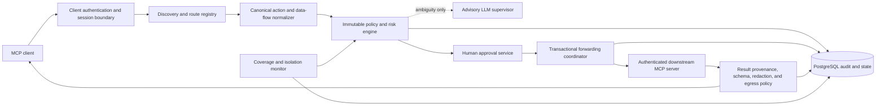

# Agent Security MCP Gateway

## Technical Specification - Phase 2

**Status:** Draft v0.9  
**Date:** 2026-09-04  
**Initial platform:** Windows 10/11 with a portable protocol core  
**Implementation:** TypeScript, Node.js active LTS, Express, PostgreSQL  
**License target:** Apache-2.0

## 1. Purpose

The project is a security reference monitor for Model Context Protocol traffic. It
authenticates an agent client, mediates discovery and tool calls, resolves the canonical
resource and effect, applies immutable policy, obtains an exact human approval when
required, forwards one authorized downstream request, validates the result, and records
a linked audit trail.

The gateway supplements least-privilege credentials, operating-system controls,
network isolation, IAM, sandboxes, backups, and downstream authorization. It does not
replace them and does not protect traffic that bypasses it.

### 1.1 Active scope and research contribution

Phase 2 governs MCP-mediated discovery, requests, results, errors, and protocol state.
It does not mediate a coding agent's native shell, filesystem, browser, or direct
network actions. A protected MCP resource is eligible for `ENFORCED` coverage only
when independent controls prevent those native paths from reproducing the protected
effect; otherwise coverage is `DEGRADED` or `UNPROTECTED`.

The research contribution is not the generic idea of an MCP gateway. It is an
effect-based, bidirectional reference monitor that tests whether authorization can
remain invariant across equivalent tools, servers, routes, paths, encodings, retries,
and transports while preserving legitimate task completion. Exact transactional
approval, truthful bypass-aware coverage, and complete-trajectory evaluation are the
supporting mechanisms. Dynamic trust is a later bounded experiment, not the security
root or the principal initial contribution.

## 2. Goals and non-goals

### 2.1 Goals

1. Mediate MCP initialization, capability negotiation, discovery, tool calls, results,
   errors, cancellation, and relevant protocol state.
2. Keep identity and credentials outside model-controlled arguments.
3. Make authorization invariant across equivalent tools, servers, paths, aliases,
   encodings, syntax, and transports.
4. Require one action-bound human approval for every Tier 3 action.
5. Fail safely when identity, route, policy, parser, persistence, protocol, or downstream
   dependencies fail.
6. Treat downstream descriptions, content, results, and errors as untrusted inputs.
7. Report protection only when the protected resource is exclusively mediated.
8. Maintain append-only, tamper-evident accountability across the complete trajectory.
9. Evaluate security, usability, latency, approval burden, and dynamic trust using
   repeatable disposable tests.

### 2.2 Non-goals

- Protecting native or direct traffic that does not cross the gateway.
- Replacing network, IAM, operating-system, sandbox, backup, or downstream controls.
- Automatically approving Tier 3 because of reputation or model confidence.
- Allowing an LLM supervisor to grant authorization.
- Automatically rolling back arbitrary remote actions.
- Using real production resources in development, tests, screenshots, or demos.
- Enabling dynamic-trust authorization before its experimental promotion gate passes.

## 3. Coverage model

| State | Meaning |
|---|---|
| `ENFORCED` | The declared protected path is authenticated, policy-controlled, audited, fail-safe, and exclusively mediated |
| `DEGRADED` | Some advertised tool, route, dependency, failure guarantee, or bypass control is incomplete |
| `OBSERVE_ONLY` | Traffic is recorded but cannot reliably be blocked |
| `UNPROTECTED` | No verified enforcing path exists |

Coverage is scoped by user, agent, client, session, server, route, tool, resource class,
and environment. An MCP call can be enforced while overall access remains degraded
because a native shell, network client, browser, filesystem tool, or direct credential
can reproduce the same effect.

A reachable bypass immediately degrades coverage and blocks protected mutations.
The product must display the missing guarantee and must never imply that MCP protects
traffic that was not routed through the gateway.

## 4. Threat model

### 4.1 Protected assets

- source code, repositories, branches, artifacts, and package supply chains;
- credentials, tokens, environment values, signing material, and identity state;
- databases, datasets, cloud resources, deployment systems, and external accounts;
- MCP server registrations, tool schemas, routes, policies, approvals, and coverage;
- audit events, trust evidence, supervisor assessments, and recovery information;
- user, agent, client, and downstream session confidentiality and integrity.

### 4.2 Threat actors and failure modes

- a legitimate agent that misunderstands intent or loses state;
- an agent compromised by direct, indirect, split, obfuscated, multimodal, propagated,
  tool-description, or tool-result prompt injection;
- a malicious user attempting to abuse tools;
- a malicious or compromised MCP client, proxy, downstream server, plugin, resource,
  database, file, or retrieval source;
- credential theft, impersonation, replay, route poisoning, schema drift, response
  tampering, and session crossover;
- flooding, recursive delegation, infinite loops, oversized payloads, retry storms,
  cancellation failure, and resource exhaustion;
- cross-tool or cross-server retries after denial;
- trust grinding, trust inheritance, delayed malicious behavior, and audit gaps;
- social engineering or fatigue that causes unsafe human approval;
- gateway, policy, parser, database, identity, route, sandbox, or downstream failure.

### 4.3 Trust boundaries

Untrusted data includes all client claims, model text, tool names and arguments,
discovery metadata, tool descriptions, server capabilities, results, errors, resource
content, repository instructions, model-generated summaries, and supervisor output.

The trusted computing base contains the authenticated gateway runtime, immutable policy,
identity and route registries, approval channel, PostgreSQL state, redaction service,
deployment isolation, and independently configured downstream authorization.

## 5. Security properties

### 5.1 Complete mediation

Every supported discovery operation and tool call is evaluated before forwarding.
Every downstream result is validated before returning to the client. No optimistic
execution is allowed while classification, persistence, approval, or revalidation is
pending.

### 5.2 Least privilege and exclusive mediation

The gateway is the sole holder of protected downstream credentials. Credentials are
audience-bound and route-scoped. Agent runtimes are prevented by independent network,
IAM, sandbox, operating-system, and downstream controls from directly reaching the same
protected resource.

The implemented V1 coverage monitor never accepts a model- or client-supplied coverage
label as authority. It collects exact-scope observations through configured probes,
pins each guarantee to trusted authorities and verifier classes, bounds freshness and
TTL, rejects source/scope mismatch and revision rollback or equivocation, and derives
separate gateway-mediated, native, and direct path states. Disposable fixture evidence
is explicitly ineligible for deployment assurance. A non-`ENFORCED` result blocks
mutations, and the current assessment digest must be rechecked immediately before the
credential-consuming operation. Assessments and control evidence are append-only in
PostgreSQL; degradation also emits a hash-chained `BYPASS` event. These mechanisms do
not themselves establish production isolation: absent deployment probes, the runtime
continues to report `UNPROTECTED` and protected forwarding remains disabled.

### 5.3 Most-restrictive decision composition

```text
DENY > REQUIRE_APPROVAL > SANDBOX > ALLOW_WITH_CONSTRAINTS > ALLOW
```

An approval can satisfy `REQUIRE_APPROVAL`; it cannot override `DENY`.

### 5.4 Representation invariance

Policy follows the resolved resource, effect, environment, route, and data flow. A
denied operation remains equally restricted when retried through another tool, server,
path form, alias, encoding, nested payload, syntax, or transport.

### 5.5 Fail-safe behavior

State-changing, external-network, privileged, sensitive, production, unknown,
route-ambiguous, schema-drifted, or unsupported operations are denied when a required
dependency fails. Only a locally proven, non-sensitive, scoped Tier 0 read may use a
documented degraded path, and coverage still changes accordingly.

## 6. Architecture



### 6.1 Repository target layout

```text
apps/
  gateway/               MCP transport and forwarding service
  policy-service/        Express policy, approval, audit, and health APIs
  approval-ui/           Local trustworthy approval and audit interface
  cli/                   Register, diagnose, inspect, approve, and evaluate
packages/
  contracts/             Versioned boundary schemas
  identity/              Client, workload, and session identity
  route-registry/        Downstream registration, discovery, and schema integrity
  action-normalizer/     Canonical resource/effect/data-flow representation
  policy-engine/         Immutable rules and decision composition
  risk-classifier/       Tiering and contextual escalation
  protocol-guard/        Replay, quota, recursion, timeout, and cancellation controls
  result-guard/          Provenance, validation, redaction, and egress policy
  approval/              Exact single-use approval lifecycle
  audit/                 Events, redaction, correlation, and tamper evidence
  trust-engine/          Shadow-mode trust and experimental gating
  supervisor/            Provider-neutral advisory interface
  coverage/              Exclusive-mediation and bypass diagnostics
test/
  fixtures/              Disposable seeded servers and protected-resource simulations
  security/              Protocol, policy, content, human, and trust suites
```

## 7. Versioned contracts

Every external payload is validated at the boundary. Unknown versions fail safely.
The initial contracts include:

- `GatewayClientV1`: authenticated user, agent, client, host, version, and capabilities;
- `GatewaySessionV1`: session ID, state namespace, coverage, quotas, and timestamps;
- `DownstreamServerV1`: server identity, transport, credential audience, capabilities,
  health, and registration provenance;
- `ToolRouteV1`: stable route ID, server/tool identity, schema digest, policy scope, and
  environment/resource mapping;
- `CanonicalActionV1`: resource, effect, data flow, environment, route, arguments,
  parsing evidence, reversibility, and call-chain context;
- `PolicyDecisionV1`: decision, tier, reasons, constraints, coverage, and policy version;
- `ApprovalV1`: exact binding fields, expiry, state, and consumption record;
- `DownstreamProvenanceV1`: authenticated server, request, route, schema, call-chain,
  transport evidence, and explicit untrusted-content status;
- `DownstreamResultV1`: request and route binding, result schema, size, provenance,
  redaction, data classification, and untrusted-content markers;
- `ExecutionOutcomeV1`: forwarded, completed, failed, cancelled, timed out, or unknown;
- `RequestOutcomeTrajectoryV1`: cross-contract identity, time, approval, forwarding,
  provenance, result, and outcome binding;
- `AwarenessV1`: factual agent-visible explanation and evaluated alternatives.

IDs and identity claims are generated or resolved by trusted components. Model-supplied
identity, risk, environment, route, or coverage claims are ignored.

### 7.1 Initial V1 client and session profile

`GatewayClientV1` uses schema version `1.0.0` and contains bounded user, agent, client,
and host identifiers; host name and version; the negotiated MCP protocol version; a
bounded unique list of normalized capability identifiers; and its trusted issuance
timestamp. Parsing the structure does not authenticate it: only the later authenticated
identity boundary may create or accept this internal contract.

`GatewaySessionV1` uses schema version `1.0.0` and binds the session and state namespace
to user, agent, client, and host identifiers. It records lifecycle status, truthful
coverage, bounded call/payload/depth quotas, creation and activity times, and expiry.
All timestamps are UTC ISO 8601 values; expiry must follow creation and activity must
remain inside that interval. Both contracts reject unknown fields and unknown schema
versions.

The initial authenticated-client boundary requires a transport-injected authenticator
before MCP JSON parsing. Its strict internal principal contains only user, agent,
client, and host identity plus authentication method, credential identifier, identity
revision, and authentication time; raw credentials are not part of the returned
contract. The loopback adapter binds that principal to an opaque transport session and
a derived state namespace. Every subsequent request is reauthenticated and must match
the bound identity, credential identifier, and identity revision. A mismatched identity
receives the same not-found response as an unknown session so it cannot confirm another
session's existence. Current end-to-end evidence uses only disposable test-fixture
authenticators; no production identity provider or durable identity repository exists.

### 7.2 Initial V1 downstream server and route profile

`DownstreamServerV1` uses schema version `1.0.0` and records the authenticated server
principal, MCP version, transport profile, credential-audience and credential-profile
identifiers, normalized capabilities, capability-integrity observation, health, and
administrator registration provenance. It never carries a credential value or raw
stdio launch command. Network endpoints reject embedded credentials, query strings,
fragments, non-HTTP protocols, and plaintext HTTP outside loopback. Capability drift
or missing observations require `QUARANTINED` health, and integrity and health
observations cannot predate registration.

`ToolRouteV1` uses schema version `1.0.0` and binds a stable route and exposed tool name
to one server, credential audience, policy scope, environment, resource resolver, and
registered schema digest. Schema drift or missing observations require a quarantined
route. Unknown environments or resource classes cannot be active. Binding validation
rejects mismatched servers or credential audiences and prevents active routes to an
unhealthy server. Route-set validation rejects duplicate route IDs and ambiguous
exposed names within the same policy scope and environment while allowing independently
scoped namespaces.

The disposable registry now establishes those boundaries for automated tests. An
injected administrator authenticator controls registration, and an injected downstream
authenticator resolves server identity outside discovery content. The registry
computes canonical SHA-256 evidence for each registration, the pinned protocol/
capability/tool-name surface, and each versioned input/output schema; these values are
not accepted as downstream assertions. Versioned allowlisted audit events bind the
administrator or authenticated server principal to registration, observation,
quarantine, review, route integrity, resolution, and denial evidence without retaining
raw schemas, descriptions, credentials, or authorization headers.

Protocol, capability, tool-set, or schema drift latches quarantine. A later matching
observation does not silently restore access; an authenticated administrator must
explicitly review the current matching state. Duplicate server IDs, route IDs, server
tool names, and scope/environment/exposed-name keys are rejected atomically. Unhealthy,
unverified, drifted, unavailable, ambiguous, and unauthorized routes are omitted or
denied. This process-local registry is disposable test infrastructure; production
persistence and authentication remain future work.

### 7.3 Initial V1 request-to-outcome trajectory profile

`CanonicalActionV1` binds authenticated identity, session, route, schema, argument
digest, resolved resources, effect, environment, data flow, parsing evidence,
reversibility, call chain, and untrusted influences. Known secret values must already
be removed. Unknown, partially parsed, unsupported, or ambiguous representations remain
expressible so deterministic policy can deny or require approval; they cannot bind to
Tier 0 or Tier 1 decisions.

`PolicyDecisionV1` records decision, tier, immutable reason codes, enforceable
constraints or sandbox profile, truthful coverage, policy version, and exact action and
route bindings. Tier 3 can only deny or require approval. Production, destructive,
privileged, credential, and irreversible actions bind only to Tier 3, and mutations
bind only to denial while coverage is not `ENFORCED`.

`ApprovalV1` carries no approval token or credential. It binds the authenticated
identity, action hash, request, session, server, tool, route, schema, credential
audience, policy scope, resources, environment, data flow, and policy version. Its
validity window is at most five minutes, and consumed state contains exactly one
forwarding-attempt record after the human decision and before expiry.

`DownstreamProvenanceV1` and `DownstreamResultV1` keep returned content explicitly
untrusted and bind result metadata to authenticated server, route, schema, request,
session, action, and call chain. Invalid or unverified schemas deny or quarantine;
credential-bearing content requires redaction, denial, or quarantine; failed redaction
denies. The disposable exact-forwarding result guard computes and verifies byte counts,
digests, provenance, classifications, redaction, and disposition before release. It
marks returned content and metadata as untrusted data rather than executable instruction.

`ExecutionOutcomeV1` separates not-forwarded, forwarded, completed, failed, cancelled,
timed-out, and unknown states. Unknown outcomes surface possible partial effects and
cannot create positive trust evidence. `RequestOutcomeTrajectoryV1` verifies exact
cross-object identifiers and chronology, prevents forwarding after denial, requires
prior matching approval consumption where applicable, and binds any result and
provenance to the same forwarding trajectory.

These schemas do not compute hashes, resolve resources, make policy decisions, consume
approvals atomically, forward calls, filter raw results, persist records, or create
trust. They define the representations and fail-safe invariants those later components
must enforce.

### 7.4 Initial V1 protocol boundary-envelope profile

`DiscoveryResultV1` returns a collision-free, policy-scope-bound set of route-backed
tools. Downstream titles, descriptions, schemas, and annotations remain explicitly
`UNTRUSTED`, and every entry states that call-time authorization is still required.
Filtering discovery never creates an authorization grant.

`ToolCallRequestV1` binds the internal and MCP request identifiers, session, exact
server/tool/route/schema/audience/scope, raw JSON arguments, argument digest, payload
size, nonce, time, and call chain. JSON values have depth, node, property, and aggregate
string bounds and reject prototype-affecting keys before parser normalization. The
contract requires credentials to be excluded, but the future authenticated boundary
must establish that fact and compute the digest and byte length.

`RawToolResultV1` accepts bounded supported MCP text, binary, resource-link, embedded
resource, and structured content while retaining an explicit `UNTRUSTED` marker. It
does not authorize release: provenance, schema, size, redaction, egress, and quarantine
processing remain required before a governed result can reach the client.

`GatewayErrorV1` exposes only a bounded normalized message and correlation metadata.
Raw downstream error content is suppressed, and possible partial effects require an
exact request binding. `AwarenessV1` is limited to non-allow decisions, canonical-data
summaries, reason codes, truthful coverage gaps, and explicitly evaluated alternatives.

All external boundary kinds dispatch through one discriminated V1 union. Unknown
kinds, mismatched kind/payload pairs, unknown fields, and forward-incompatible payload
versions fail validation. These contracts still provide representation validation,
not authentication, replay protection, current-time checks, digest computation,
authorization, result mediation, or forwarding.

## 8. Identity and session isolation

- Authenticate clients over a protected local or mutually authenticated transport.
- Derive user and workload identity outside MCP arguments.
- Issue installation/client identities and rotate them through an audited workflow.
- Namespace routes, downstream connections, caches, approvals, quotas, results, audit
  chains, and trust state by authenticated session.
- Prevent one session from selecting, observing, or mutating another session's state.
- Bind credentials to the intended audience and route; never include them in model
  context, command lines, routine logs, or downstream calls to another audience.
- Identity rotation invalidates incompatible approvals and freezes trust until reviewed.

The implementation now includes a protected mutual-TLS client identity profile for
the operational runtime. The HTTPS boundary requests and verifies a client
certificate against an operator-supplied CA, derives normalized certificate facts
from the TLS socket rather than headers or MCP arguments, and resolves the SHA-256
certificate fingerprint against an authoritative PostgreSQL registry on every
request. The registry retains append-only identity revisions and audit events;
registration, rotation, and revocation are transactional, old revisions cannot be
reactivated by restart or another process, and private keys and certificate bytes are
never stored. Missing TLS, CA, database, inactive/revoked identity, validity, client-
authentication EKU, or registry integrity fails closed. The protected startup path
requires all TLS and PostgreSQL settings and contains no `TEST_FIXTURE` fallback.

The implementation also retains a disposable authenticated state repository whose
separate route, downstream-state, approval, quota, result, and audit compartments can
be accessed only through the session's authenticated binding. Values are bounded JSON
and are cloned on ingress and egress so callers cannot mutate stored state through
shared references. Unknown and cross-identity sessions fail with the same generic
denial. This process-local repository is automated-test infrastructure, not a durable
runtime fallback; PostgreSQL remains mandatory for the production boundary.

A disposable gateway-held vault validates credential material against its registered
SHA-256 digest and keeps that material behind a non-returning API. It issues metadata-
only leases capped at five minutes and at the profile expiry, bound to the credential
revision, exact audience, exact route, transport session, and state namespace. Wrong
audience, route, session, expiry, revocation, or unknown profile/lease fails closed.
The disposable vault now exposes one credential-consuming HTTP sink that validates the
session lease, profile, audience, route, and pre-registered endpoint origin, injects
the credential internally, refuses redirects, and returns no credential material or
request headers to its caller. It remains test infrastructure and is not connected to
the client-facing lifecycle adapter.

A production-shaped secret-manager broker now requires a provider descriptor whose
disposition is explicitly `APPROVED`, obtains one exact secret revision only at the
moment of use, verifies its profile/revision/reference/digest, and binds the resulting
lease to the authenticated session namespace, audience, route, canonical endpoint
origin, and a lifetime of no more than five minutes. Credential bytes are available
only inside the broker's non-redirecting HTTP sink and all provider and working buffers
are zeroized in `finally`; material, headers, and request objects are never returned.
Provider failure, substitution, cancellation, and binding mismatch fail closed. The
approved HashiCorp Vault KV v2 adapter adds a canonical versioned secret reference,
HTTPS-only provider boundary, bounded response parsing, exact returned-version check,
manual redirect handling, and token-buffer zeroization. Plain HTTP is available only
through an explicit loopback-only disposable-test option.

When the same authenticated subject presents a changed credential identifier or
identity revision, the session is quarantined, shadow trust is frozen, routes,
downstream state, approvals, and quotas are cleared, and session credential leases are
revoked. Results and audit compartments remain retained for accountability. A wholly
different subject receives only the generic denial and cannot use rotation handling to
mutate the owner's session. A checksum-verified HashiCorp Vault 1.21.1 development
server has been exercised on loopback with an exact KV v2 revision through the broker
and one disposable downstream request. This validates the concrete provider boundary,
not production Vault configuration, credential custody, isolation, or coverage;
protected forwarding and production coverage remain disabled.

## 9. MCP lifecycle and protocol controls

### 9.1 Initialization and discovery

Server registration is administrator-controlled. The registry records server identity,
protocol version, capabilities, tool names, tool schemas, schema hashes, route ownership,
credential audience, environment, and policy scope.

The protected PostgreSQL administration boundary requires a strict authenticated
client principal and a separate trusted administrator-authorizer decision before any
write. It appends monotonically versioned, kind-bound `SERVER`, `ROUTE`, `SCHEMA`, and
`POLICY` documents under transaction and advisory locks, with immutable audit events
bound to the actor identity digest and exact document digest. Database constraints and
composite foreign keys reject stale versions and cross-kind substitution; update and
delete triggers make resources, versions, and audit records append-only.

The initial protocol core pins MCP revision `2025-06-18` and models the required
`initialize` request, server response, and `notifications/initialized` ordering as an
explicit per-connection state machine. Before and during initialization, only `ping`
is operational. The server may select its supported revision when the client requests
another revision; the client remains responsible for disconnecting if it cannot support
that selection. Additional client capabilities are bounded and recorded but never
implicitly become gateway capabilities.

Without a trusted discovery provider, the initialization response advertises an empty
server capability set. With one configured, it advertises only `tools/list`; the
gateway-generated response uses the freshly reauthenticated session binding, validates
the provider result, limits serialized output to one MiB, marks downstream metadata
untrusted, and re-evaluates visibility on every request. A successfully initialized
core enters `READY_NON_FORWARDING`, rejects duplicate initialization and every other
operational method, retains `UNPROTECTED` coverage, and cannot forward a protected
call. The loopback-only Streamable HTTP adapter binds the lifecycle to an opaque
transport session, validates Origin and content negotiation, requires the negotiated
protocol-version header on subsequent requests, and supports explicit session
termination. It is not yet a protected forwarding path.

Unexpected capability or schema changes are quarantined. Duplicate, shadowed,
ambiguous, unavailable, or unauthorized routes fail safely. Clients see only authorized
tools, but every call receives a fresh call-time evaluation.

The current disposable registry implements discovery filtering as a separate operation
from route resolution. Its injected authorizer receives `DISCOVERY` or `CALL_TIME` for
the authenticated session and exact current server/route contracts. A route visible in
an earlier discovery result creates no grant: call resolution repeats authorization
and current health/integrity checks. Discovery metadata remains marked `UNTRUSTED`, and
coverage remains `UNPROTECTED`. A real disposable HTTP MCP peer has exercised
initialization and `tools/list` ingestion. The client-facing runtime now exposes
registry-backed `tools/list`, while `tools/call` remains unavailable and no protected
call can be forwarded.

### 9.2 Protocol abuse limits

Require request IDs, timestamps, nonces, bounded clock skew, and replay caches. Apply
configurable safe bounds to payload and result size, calls per interval, concurrency,
call depth, delegation depth, fan-out, redirects, retries, and total execution time.

Detect cycles and recursive delegation. Propagate cancellation to downstream work.
Circuit breakers prevent protected mutations while identity, policy, persistence,
route, coverage, or downstream health is insufficient.

The disposable host-neutral protocol guard now validates a versioned operation record
before work begins. Authenticated session namespaces scope request-ID and nonce replay
caches; timestamps must remain inside configured skew. Rate and concurrency admission
is atomic across session, user, agent, client, server, tool, route, destination, and
action-family keys. Rejected operations cannot partially reserve concurrency;
structurally valid attempts consume replay identity before later policy-independent
guard denial, and admitted operations consume their rate position.

Configured admission and runtime checks bound request and expected/observed result
bytes, call and delegation depth, fan-out, redirects, retries, concurrency, and total
execution time. Ancestry must be ordered and unique; repeating a request or the same
route/destination/action-family signature in its ancestry is recursive and denied.
Dynamic checkpoints release reservations even when malformed or over limit.

The guarded runner propagates an external cancellation or deadline through an
`AbortSignal`, releases all concurrency reservations, and records a normalized event.
Required dependencies are unavailable unless a trusted health observation has closed
their circuit. Failures degrade immediately, open a circuit at the configured
threshold, and deny before operation invocation until an explicit trusted success.
Versioned allowlisted audit records contain correlation identifiers and evidence
digests but no arguments, results, authorization headers, or credentials.

These controls have been exercised around real disposable HTTP requests, but remain a
process-local automated-test component. The client-facing gateway still advertises no
operational tools and performs no protected forwarding. Production adapters must feed
trusted byte counts, redirects, retries, ancestry, dependency health, and cancellation
into this guard and persist its audit state rather than falling back to memory.

## 10. Canonicalization and policy

The evaluation order is:

1. Authenticate the client and resolve the session.
2. Validate protocol state, replay evidence, and quotas.
3. Resolve the registered server, route, tool schema, and policy scope.
4. Validate and normalize arguments without executing agent-provided code.
5. Resolve canonical resources, effects, environment, data flow, and call chain.
6. Apply immutable denials.
7. Parse and classify category-specific semantics.
8. Apply contextual risk escalation and policy layers.
9. Consult shadow-mode trust only where allowed.
10. Invoke the supervisor only for unresolved semantic evidence.
11. Compose the most restrictive decision.
12. Persist the request, normalized action, evidence, and decision before responding.

Dedicated analyzers are required for filesystem, shell, Git, package, network,
database, cloud, browser, process, deployment, and schema-specific MCP operations.
Opaque payloads and unsupported tools require approval or denial.

The required-analyzer registry makes those eleven categories explicit and refuses a
resolved finding for a missing or mismatched analyzer, unknown operation, syntax, or
version, analyzer exception, malformed or partial result, or category substitution.
Every such case is quarantined as ambiguous with an unknown effect; downstream policy
cannot infer low risk from the original payload.

The initial host-neutral canonicalization boundary now revalidates the authenticated
session namespace and the current registered server, route, tool, schema, credential
audience, and policy scope before accepting an action. It recomputes canonical JSON
argument digests and byte lengths, binds ordered call-chain ancestry, and selects only
the resolver configured by the registered route. Resolver absence, failure, partial
parsing, unsupported syntax, or disagreement with the route's resource class or
environment produces an explicit unresolved action rather than a guessed low-risk
classification. Windows and POSIX paths and URI references receive bounded Unicode,
percent-encoding, separator, dot-segment, host, port, fragment, and query-order
normalization; semantic aliases still require one stable resource identity from the
trusted category resolver.

The deterministic policy engine classifies only a fully parsed public non-egressing
read as Tier 0 and only a fully parsed, reversible, non-egressing development/test
write as Tier 1. Known Tier 2 actions require approval unless an enforceable sandbox
profile is configured. Production, administrative, destructive, credential-bearing,
and difficult-to-reverse mutations are Tier 3. Unresolved actions require approval
under enforced coverage and otherwise deny; every mutation denies while coverage is
not `ENFORCED`. Built-in denials, administrator rules, coverage invariants, and
trust/supervisor advisories are combined by the documented most-restrictive ordering.
Advisories can add restrictions but cannot lower the deterministic result, and
conflicting sandbox profiles or constraint identities deny.

These components remain host-neutral policy infrastructure. Category resolver
correctness is part of the trusted computing base and only disposable resolvers exist.
The first client-facing call-composition slice now resolves a trusted exact route and
schema set, creates gateway-owned request digests and replay identity, admits the call
through the protocol guard, canonicalizes it, applies deterministic policy under the
configured truthful coverage state, and awaits atomic PostgreSQL request/action/decision
persistence before returning. Persistence or any earlier dependency failure produces no
decision response and no downstream invocation. The returned decision is deliberately
non-forwarding; canonical awareness, approval, forwarding, result, and outcome
composition remain required before an operational protected call can be enabled.

### 10.1 Risk tiers

| Tier | Meaning | Default treatment |
|---|---|---|
| 0 | Proven non-sensitive read with no executable or disclosure side effect | Allow when scope and coverage are verified |
| 1 | Reversible local write inside an approved isolated scope | Allow or constrain according to immutable policy |
| 2 | Executable, networked, supply-chain, account, or meaningful state change | Sandbox, constrain, or require approval |
| 3 | Production, privileged, destructive, credential-related, broad, or difficult to reverse | Require one exact approval or deny |

Tests, linters, builds, and package commands are at least Tier 2 when they can execute
repository or dependency code. Unknown parsing can never yield Tier 0 or Tier 1.

## 11. Constraints and sandboxing

`ALLOW_WITH_CONSTRAINTS` is valid only when the gateway can atomically enforce the
modified request. Examples include an exact route, method, hostname, path prefix, row
limit, transaction, non-production environment, payload field set, or response field
filter.

`SANDBOX` requires an identified execution profile with bounded filesystem, process,
network, credentials, CPU, memory, storage, and time. If the sandbox guarantee cannot
be verified, escalate to approval or denial.

## 12. Human approval

Every Tier 3 action requires an explicit human decision. Approval is bound to:

- authenticated user, agent, client, and session;
- canonical action and argument hash;
- exact server, tool, route, and schema hash;
- resolved resources, environment, data flow, and policy version;
- expiry and one atomic consumption record.

Approval expires after five minutes by default. The gateway revalidates identity,
policy, route, schema, resources, environment, coverage, and downstream health
immediately before consuming it and forwarding the exact request once.

The approval interface derives its summary from validated canonical data and displays
requester, route, target, data sent, provenance, untrusted influence, unresolved scope,
risk, reversibility, blast radius, related attempts, recovery classification, coverage,
and missing guarantees. Tier 3 has no bulk, persistent, or always-allow option.

The initial host-neutral approval service now accepts only an exact
`REQUIRE_APPROVAL` action/decision binding with a valid canonical action hash and the
matching authenticated session. It creates a maximum five-minute record with no token
or credential material. A strict human-decision assertion binds one authenticated
human, approval identifier, action hash, and `APPROVE` or `DENY` choice; unknown fields
such as persistent or always-allow controls are rejected.

Before consumption, the service synchronously revalidates the full authenticated
session including credential and identity revision, current healthy active route and
schema, and a freshly bound most-restrictive policy decision at the same policy
version. Exact action, identity, route, schema, audience, scope, resource, environment,
data-flow, and policy bindings must still match. The record is changed to `CONSUMED`
with one service-generated forwarding-attempt identifier before the one forwarding-
start callback runs. Replay, parallel use, expiry, human denial, changed state, and
callback failure cannot make the approval reusable; session invalidation revokes any
pending or approved record. Allowlisted audit events contain only identifiers, reason
codes, timestamps, and evidence digests.

The original approval service remains process-local automated-test infrastructure. The
PostgreSQL trajectory store now separately persists an approved record and atomically
consumes it under a row lock while creating a unique forwarding attempt, providing
restart and multi-connection replay resistance for the disposable integrated path. A
production human authenticator remains future work. The client-facing runtime admits
calls through durable non-allow decisions and remains globally `UNPROTECTED`; only the
separate trusted disposable approval continuation can exercise synthetic exact-scope
`ENFORCED` forwarding.

The client-facing integration layer now also has a trusted approval continuation that
accepts only an approval identifier and the authenticated session. It reloads the
request, canonical action, decision, and approved record through an injected trusted
provider, constructs gateway-owned forwarding authorization, awaits PostgreSQL atomic
consumption, and only then obtains a route-scoped credential lease and invokes the exact
forwarder. A failed or losing consumption attempt cannot reach credential use. Coverage
revalidation selects the newest exact-scope assessment before requiring fresh
`ENFORCED` state, so older enforcing evidence cannot survive a newer degradation.
The continuation converts every mediated success, tool error, withheld result,
transport failure, or cancellation into a bound execution outcome and awaits either
transactional result/provenance/outcome persistence or terminal-outcome persistence
before returning the governed release or normalized error.
Client transport disconnects propagate an abort signal into call admission. The
coordinator checks the guard signal around asynchronous coverage and persistence so a
timed-out or cancelled operation cannot later persist a decision. Post-consumption
credential-vault failure, exact-forwarder binding failure, transport uncertainty,
cancellation, and timeout create terminal durable outcomes; approvals remain consumed.
This is disposable integration evidence, not a production approval channel or global
coverage claim.

The implemented trustworthy-interface layer derives every displayed field from the
validated canonical action, deterministic decision, scoped coverage assessment, and
correlated outcome. It rejects mismatched records and unknown bulk or persistent
controls, emits factual structured awareness with evaluated alternatives for every
non-allow response, and records presentation, related-attempt, decision-latency,
approval, denial, expiry, revocation, and error events by policy scope. Interface and
fatigue events are append-only in PostgreSQL, and every persisted outcome now creates
a recovery record from its validated recovery class and partial-effect state.

### 12.1 Functional human approval and audit web interface

The host-neutral trustworthy-interface layer is a data and validation boundary; it is
not a completed operator-facing application. A production-candidate gateway requires a
runnable local web interface that loads live pending approvals and correlated audit
state from the protected runtime. Static wireframes, generated screenshots, fixture
records, or model-authored summaries cannot satisfy this requirement.

The web interface must authenticate the human independently of the requesting agent,
authorize the exact policy scope, and protect its browser session and decision requests
against CSRF, origin confusion, session fixation, replay, stale state, cross-user
access, and client-supplied authority. It may offer only `Approve once` and `Deny` for
one displayed approval. Bulk, persistent, wildcard, and always-allow decisions are not
valid controls.

Every display field must be derived from the validated canonical action, deterministic
decision, current coverage assessment, and correlated durable records. The operator
must see the authenticated requester, server, tool, route, target, data flow,
provenance, risk, reversibility, blast radius, untrusted influence, related attempts,
expiry, recovery class, coverage, and exact missing guarantees before deciding. The
interface must then show the durable approved, denied, expired, revoked, consumed, or
failed state and the governed outcome without exposing credentials, approval secrets,
raw untrusted errors, or unauthorised cross-scope audit data.

An `APPROVE` decision is not sufficient by itself: the web boundary must have a trusted
protected-runtime continuation configured. Without it, approval fails before changing
state. The protected entrypoint now composes this continuation with PostgreSQL as the
trusted session resolver and approved-call loader plus the real client approved-call
executor. It passes only the approval identifier and authenticated human identifier;
the runtime reloads canonical authority from PostgreSQL, revalidates coverage and
bindings, atomically consumes the approval, and owns forwarding and outcome persistence.
Startup fails if its operator-supplied credential lease or exact forwarder module is
missing or incomplete. Production-approved providers and deployment evidence remain
required before protected forwarding can be enabled.

The production-shaped runtime composition now passes the executor-generated forwarding
authorization into credential issuance, preventing a lease from being created without
the exact approval, action hash, route, audience, endpoint, session, and durable
forwarding-attempt binding. The approved HashiCorp Vault provider, non-exporting broker,
exact HTTP forwarder, downstream authenticator, schema/result guard, and PostgreSQL
outcome store have been exercised together through a real Chromium approval workflow.
This remains disposable browser evidence and does not establish production Vault
custody, independent isolation, or protected deployment coverage.

The human decision transaction also inserts one immutable-bound runtime dispatch row.
The continuation must atomically claim that row before resolving the agent session or
executing the call. A bounded periodic recovery worker uses row locks with
`SKIP LOCKED`, so concurrent workers recover each stale dispatch once. A stale
unconsumed `APPROVED` record is revoked with durable failure audit and no forwarding
attempt. A stale dispatch whose approval was already atomically consumed is never
retried: if no outcome exists, recovery records `UNKNOWN`, possible partial effects,
and a recovery record before closing the dispatch. Claim timeout must exceed the
executor timeout, preventing a live bounded execution from being reclaimed early.

Automated browser and integration evidence now covers the actual path from a live
pending request through authenticated human display, exact decision, PostgreSQL state
transition, atomic consumption, at most one downstream forwarding attempt, governed
result, and audit/outcome display. The matrix includes reload/reconnect, duplicate and
multi-tab concurrent decisions, expiry, revocation after stale coverage, authentication
and scope failure, CSRF/origin rejection, provider and result failure, keyboard
operation, and unambiguous durable states. A bound non-content result summary exposes
the disposition and schema verdict, preventing quarantined content from appearing as
an ordinary successful release. This completes `P2-F020` with disposable evidence;
`P2-F010` remains the host-neutral model, and production isolation and provider
assurance remain deferred production work outside the completed local `P2-F019` scope.

## 13. Transactional forwarding

The forwarding coordinator records an authorized-but-not-forwarded state, atomically
consumes approval where required, creates a one-time forwarding record, and sends the
exact registered request with route-scoped credentials. Modified or repeated calls are
new attempts.

Timeout, cancellation, transport error, ambiguous outcome, and downstream failure are
recorded separately. An unknown outcome cannot generate positive trust and must surface
possible partial effects to the user.

## 14. Downstream result and data-flow security

Every result, error, resource payload, and metadata object is untrusted. Before return:

1. Bind it to authenticated server, route, schema, request, session, and call chain.
2. Enforce protocol and schema validity.
3. Enforce size, type, redirect, and content limits.
4. Classify sensitive data and apply egress policy.
5. Redact known secrets and prohibited fields.
6. Separate data from instructions and mark provenance for the client.
7. Deny, redact, or quarantine invalid or unsafe content.
8. Persist only the allowed redacted audit representation.

An LLM detector may add advisory evidence but cannot authorize disclosure or declare
content safe.

## 15. PostgreSQL persistence and audit

PostgreSQL is mandatory at runtime. Core tables include identities, clients, sessions,
servers, routes, schema versions, requests, canonical actions, decisions, reasons,
approvals, forwarding attempts, results, outcomes, policies, coverage events, protocol
violations, trust events, supervisor assessments, and recovery records.

Requirements:

- forward-only migrations and startup failure when persistence is unavailable;
- append-only security events with hash chaining or equivalent tamper evidence;
- transactional decision, approval, forwarding, result, and outcome linkage;
- correlation across denied, modified, alternate-route, concurrent, replayed, bypass,
  approved, forwarded, cancelled, failed, and completed attempts;
- UTC ISO 8601 timestamps and versioned policy/schema references;
- centralized redaction before storage and logging;
- no persistence of known credential values;
- audited retention and deletion policies.

The initial PostgreSQL implementation applies a checksummed forward-only migration for
the complete listed trajectory plus coverage, protocol-violation, supervisor, and
recovery tables. Startup requires an explicit reachable PostgreSQL URL and never falls
back to in-memory persistence. Transactions atomically persist request/action/decision
state, consume approvals and create unique forwarding attempts, and link governed
provenance, results, outcomes, shadow trust evidence, and security events. Approval
row locks and uniqueness constraints preserve one-time consumption across concurrent
connections and store restarts. Security events are serialized into a SHA-256 chain
and protected from update or deletion by a database trigger. Raw arguments and result
content are omitted from ordinary trajectory, audit, and interface documents. For an
approved runtime continuation only, the exact request is stored in a separate
append-only table as AES-256-GCM ciphertext with a unique 96-bit nonce, 128-bit
authentication tag, explicit key identifier, and request-bound additional authenticated
data. The external 256-bit key is mandatory for approved-call loading and is never
stored in PostgreSQL; missing keys, key-id mismatch, authentication failure, or binding
mismatch deny. Plaintext buffers are bounded by request validation and wiped after use.
The approval decision and its runtime dispatch are committed atomically. Dispatch
authority is immutable, state transitions are database-constrained, deletion is
forbidden, and stale recovery is serialized across workers without retrying an
ambiguously forwarded request.
Configured known secrets still cause rejection before any database query. Real
PostgreSQL 18.4 integration evidence is disposable development evidence, not production
deployment hardening or exclusive-mediation proof.

## 16. Coverage, health, and observability

Coverage continuously verifies client authentication, route integrity, policy health,
persistence, approval availability, protocol guards, downstream authentication,
credential exclusivity, result mediation, and external bypass controls.

Metrics include decisions, tiers, routes, protocol violations, replays, quota events,
recursion, cancellations, schema drift, result quarantines, secret redactions, approval
frequency/errors, latency, trust changes/freezes, coverage degradation, safe re-plans,
and repeated risky attempts. Telemetry is local by default and never includes raw
secrets or source content.

## 17. Recovery and dynamic trust

### 17.1 Recovery

Every mutation records one recovery class: verified compensating action, tested
snapshot/backup, partially reversible, irreversible, or unknown. A compensating action
is a new separately evaluated proposal, never an unchecked automatic rollback.

### 17.2 Dynamic trust experimental gate

Trust is scoped by authenticated user, agent, client, host, and policy scope. It begins
in shadow mode and cannot change authorization during baseline collection.

Trust can never bypass immutable denial, Tier 3 approval, unknown parsing, environment
escalation, route/schema drift, missing outcomes, or degraded coverage. Classification
alone and lack of user disagreement are not positive evidence. Positive evidence
requires an eligible verified outcome; LLM output alone cannot create it.

Audit gaps, identity rotation, route/schema changes, anomalies, and missing outcomes
freeze positive influence. Permission influence requires predefined evaluation
thresholds comparing static policy, policy plus awareness, and bounded trust.

The implemented V1 research controller starts in `SHADOW` and requires every observed
effective decision to equal deterministic policy. It compares exactly paired repeated
trials for static policy, policy plus awareness, and bounded-trust counterfactuals, and
computes documented promotion gates for attack success, false allows, policy and
immutable-exclusion violations, enforced coverage, task completion, false denials,
approval frequency and error, latency, and trust-grinding resistance. Failed evidence
or thresholds retain shadow mode.

A passing report enables only a runtime-validated disposable counterfactual path for
an exact action/decision and trust-scope binding. The authoritative decision remains
deterministic policy. Any Tier 2 or Tier 3 action, denial, invariant reason, unresolved
action, production environment, non-`ENFORCED` coverage, or scope mismatch is
ineligible. Candidate evidence must be mature, independently verified, audit-complete,
safe, non-partial, non-approval-backed, validly released, and scope-bound. Audit gaps,
identity rotation, route or schema changes, anomalies, and missing outcomes latch the
controller in `FROZEN`. This implementation evaluates promotion safely; it does not
enable trust influence in the production authorization path.

## 18. Advisory LLM supervisor

The optional supervisor receives only minimal redacted context with untrusted content
explicitly delimited. It returns a strictly validated, versioned assessment containing
semantic category, risk indicators, intent alignment, confidence, evidence references,
and a recommended decision.

The result is advisory. Invalid output, low confidence, timeout, or provider failure
falls back to deterministic policy and normally approval or denial for unresolved
ambiguity. Provider, model, prompt version, response hash, latency, and redaction
summary are audited. External submission can be disabled globally or by exact policy
scope, and is disabled by default. V1 provider requests contain only an allowlisted
semantic policy context plus bounded untrusted fragments after secret, credential,
path/URI, delimiter, control-character, and length redaction. Fragments are explicitly
marked data-only and delimited; raw arguments, results, canonical references,
credentials, and identity values are omitted. Strict output accepts only DENY or
REQUIRE_APPROVAL, binds the assessment and input digest, and cannot grant authorization.
Timeout, invalid output, low confidence, provider failure, or unavailable audit falls
back to deterministic policy or fails closed. Redacted assessment records are bound to
the exact request, action, decision, session, route, schema, policy scope, and policy
version in an append-only PostgreSQL audit table.

## 19. Security evaluation

All testing uses disposable, seeded resources. The evaluation program contains:

1. Protocol tests: replay, flooding, recursion, cancellation, schema drift, route
   collision, impersonation, audience binding, and dependency failure.
2. Policy-invariance tests: equivalent tools, servers, paths, encodings, transports,
   retries, split payloads, concurrency, and time-of-check/time-of-use.
3. Content tests: direct, indirect, obfuscated, propagated, malicious tool-description,
   and malicious tool-result injection.
4. Human/trust tests: fatigue, misleading context, re-planning, grinding, identity
   changes, audit gaps, delayed harm, and anomaly freezes.

Compare native/static controls, immutable gateway policy, policy plus awareness, and
bounded trust. Report repeated-trial distributions for dangerous-action prevention,
attack success, completion under policy, risk ratio, false allow, false denial/warning,
latency, cost, approval frequency/error, safe re-plan rate, repeated risky attempts,
and verified coverage.

Automated judges must be validated against human annotations and tested for sensitivity
to trace formatting, redaction, model choice, random seed, and task paraphrase.

The implemented V1 evaluation harness provides a complete 30-class catalog across the
four required suites. Each scenario has a version, configuration digest, seed, and at
least two repetitions; derived per-trial seeds make runs reproducible. Observations
must cite a deterministic assertion, disposable workflow, or human-validated evidence
digest. Reports retain bounded trial records and calculate prevention, attack/baseline
success, risk ratio, completion under policy, false allow/denial, mean/p50/p95 latency,
cost, approval frequency/error, safe re-planning, and enforced coverage. The harness
measures supplied evidence; it does not relabel simulated observations as integration.

The V1 multi-host validator accepts at least two unique host-adapter identities and
runs each repeated workflow concurrently. Evidence and reports are canonically
digested. Equivalent workflows must produce one canonical effect digest and policy
decision, while session identifiers and identity, route, quota, approval, trust,
result, and audit compartment digests must remain unique across the entire run.
Reports expose per-host completion, failure, policy-violation, approval/error, latency,
and enforced-coverage rates. Native and direct bypass inventory entries are structurally
unable to claim gateway protection or `ENFORCED` coverage. Disposable adapters validate
this host-neutral contract; production-host interoperability remains a separate
deployment claim and requires deployment evidence.

The V1 independent-security-review evidence boundary binds a named external reviewer
and organization, independence declaration, exact source revision, runtime and
configuration digests, reviewed scopes, findings, remediation evidence, and residual-
risk authorization into one canonical report. Open material findings force rejection;
accepted risk requires a separately identified risk owner, and the reviewer cannot
self-authorize it. The contract is deliberately labelled `EVIDENCE_CONTRACT_ONLY`:
schema validation and canonical digests prepare and protect review evidence but do not
prove reviewer independence, verify a signature, or substitute for an actual review.

A disposable interoperability verifier additionally pins the open-source MCP
Everything reference server and Microsoft Playwright MCP package versions and registry
integrity hashes, launches both with sanitized environments, negotiates MCP over stdio,
lists real tools, completes one harmless tool call, and requires unknown-tool rejection.
Its retained artifact is explicitly `LOCAL_INTEROPERABILITY_ONLY`,
`independentlyOperated: false`, and `UNPROTECTED`. Separate upstream maintainers do not
make locally launched processes independently operated. Under the user-approved
2026-09-20 local-delivery scope, this reproducible two-implementation workflow completes
`P2-F018`; independently operated hosts and external security review remain deferred
production-assurance gates and are not implied by feature completion.

## 20. Delivery sequence and acceptance

### Milestone 1 - Safe protocol foundation

- versioned contracts, initialization, capability negotiation, and no protected
  forwarding;
- authenticated identities and isolated sessions;
- integrity-checked server registration, discovery, and routing;
- replay, quota, recursion, timeout, cancellation, and circuit-breaker controls.

### Milestone 2 - Authorization reference monitor

- canonical resource/effect/data-flow normalization;
- immutable policy, risk classification, and most-restrictive composition;
- transactional PostgreSQL decisions and audit;
- exact single-use approval and one-time forwarding.

### Milestone 3 - Complete execution boundary model

- result provenance, schema validation, redaction, egress policy, and quarantine;
- gateway-held credentials and independently blocked direct access;
- truthful coverage and health diagnostics;
- trustworthy host-neutral approval, awareness, audit, and recovery interface model.

### Milestone 4 - Security evaluation

- protocol, invariance, content, human, and trust security suites;
- validation with at least two MCP-compliant hosts;
- repeated-trial security, usability, latency, approval, and coverage metrics.

### Milestone 5 - Controlled research features

- dynamic trust shadow-mode comparison and promotion decision;
- optional advisory supervisor after deterministic controls are established.

### Milestone 6 - Operational integration and local release evidence

- authenticated client-facing discovery and complete `tools/call` composition;
- approved production-shaped identity, credential, administration, and analyzer providers;
- functional authenticated human approval and audit web interface;
- two pinned open-source MCP server implementations exercised locally with explicit
  local-only evidence;
- non-production deployment, artifact, SBOM, recovery, and rollback evidence.

Independently operated hosts, external security review, exclusive production
mediation, production credential custody, and signed publication are deferred
production-assurance work outside the approved local Phase 2 completion scope.

Phase 2 local delivery is complete only when all acceptance criteria in
`docs/featurelist.json` pass, required validation succeeds, downstream results are
governed, Tier 3 remains exactly approval-gated, and coverage remains truthful. This
does not authorize production use: without exclusive mediation and production evidence,
coverage remains `UNPROTECTED` and protected forwarding remains disabled. A host-neutral
approval view or wireframe cannot satisfy local delivery: the `P2-F020` browser workflow
and its end-to-end human-decision evidence must also pass.

The completed local release gate additionally requires the two pinned open-source MCP
interoperability checks, hardened disposable container verification, SBOM and manifest
verification, reproducible build, dependency audit, and explicit unsigned/unpublished
artifact posture. Independently operated hosts, external review, production isolation,
credential custody, signing, and publication remain deferred production-assurance gates.
