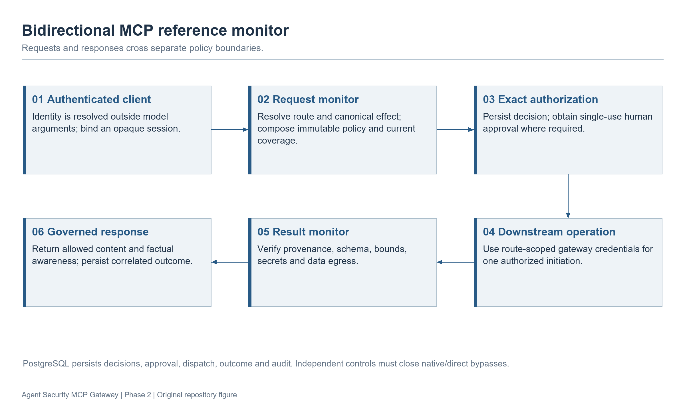
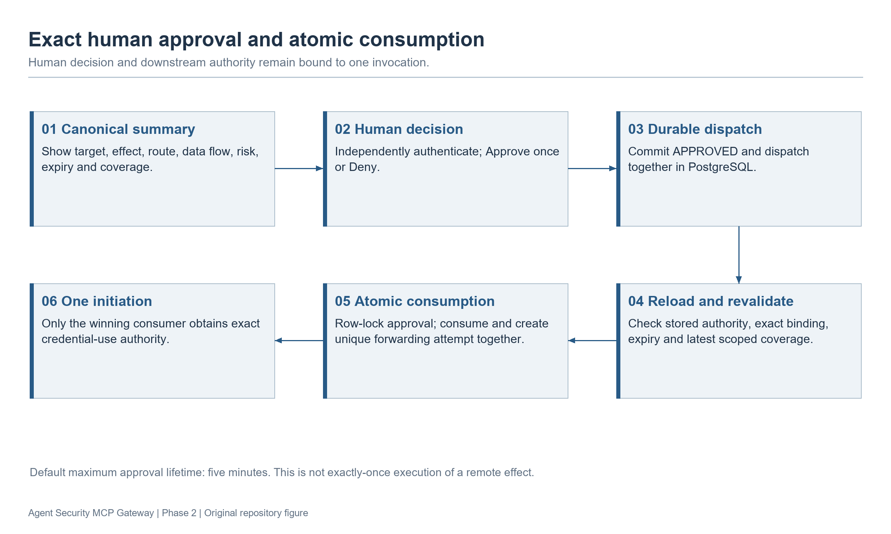

# Review 3 — Agent Security MCP Gateway

Slide-ready content for a **10-minute project review**, prepared 2 October 2026.
Use the **On-slide content** in PowerPoint; keep the explanations in presenter notes.
The sections below cover only the Review 3 topics in the supplied review sheet.
Replace the title-slide placeholders with your actual details.

| Required topic | Slides | Speaking time |
| --- | --- | --- |
| Title | 1 | 15 seconds |
| Objectives | 2 | 35 seconds |
| Details on the analysis/design of the system/algorithm | 3–6 | 3 minutes |
| Results and Discussion/Demonstration | 7–10 | 3 minutes 30 seconds |
| Contributions | 11 | 50 seconds |
| Conclusion and Future Work | 12 | 55 seconds |
| References | 13 | 10 seconds |
| Publications/patents, if any | 14 | 5 seconds |

Design and results receive most of the speaking time because they carry 40 and 60
marks respectively. Contributions carry 30 marks; conclusion/future work carry 20.
Use a 16:9 layout, short bullets, and one large diagram per diagram slide.
The linked PNGs are ready to insert; matching SVGs support resizing in PowerPoint.

---

## Slide 1 — Title

### On-slide content

**Agent Security MCP Gateway**

Effect-Based Authorization and Bidirectional Mediation for AI Tool Use

- Project Review 3
- Team: [Names and register numbers]
- Guide: [Guide name and designation]
- Department / Institution: [Details]

### Presenter notes

Our project controls AI tool requests passing through Model Context Protocol, or
MCP. It checks the requested action before execution and validates the response
before returning it to the agent.

---

## Slide 2 — Objectives

### On-slide content

- Authenticate MCP clients and isolate their sessions.
- Authorize the actual resource and effect across equivalent tool representations.
- Require exact, single-use human approval for high-risk actions.
- Validate downstream results and prevent credential exposure.
- Record the full request-to-outcome audit trail and disclose coverage gaps.

### Presenter notes

MCP connects AI applications to external tools and data. Its security guidance
places responsibility for consent and access controls on implementors. Our
objective is to provide an enforcing boundary for supported MCP traffic.
Native shell, browser, filesystem, and direct network operations need separate
controls when they can bypass that boundary.

**Reference:** [MCP specification, revision 2025-06-18](https://modelcontextprotocol.io/specification/2025-06-18).

---

## Slide 3 — Analysis: Threats and System Boundary

### On-slide content

| Threat | Required control |
| --- | --- |
| Malicious tool arguments or misleading descriptions | Trusted routing, schema validation, effect resolution |
| Retrying a denied effect through another tool | Canonical resource/effect policy |
| Reusing or racing an approval | Exact binding and atomic consumption |
| Unsafe content or secrets in returned results | Result validation, redaction, denial/quarantine |
| Direct access around the gateway | Independent isolation and truthful coverage |

**Boundary:** supported MCP traffic; current deployment coverage: `UNPROTECTED`.

### Presenter notes

The agent, downstream servers, and their content can all supply untrusted data.
Checking a tool name alone cannot establish what a request will do. We also avoid
calling a deployment protected when another route can reproduce the same effect.
The current local deliverable keeps protected production forwarding disabled.

**Optional alternative visual:** [Bypass and trust boundaries](images/14-bypass-trust-boundaries.png).
Use this instead of the table if the slide becomes crowded.

---

## Slide 4 — Design: Gateway Architecture

### On-slide content

- Request path: authentication → trusted route → canonical action → policy → approval.
- Execution path: durable consumption → exact forwarding → governed result.
- PostgreSQL records decisions, approvals, attempts, outcomes, and audit evidence.
- Stack: TypeScript, Node.js, Express, PostgreSQL, Zod.



**Caption:** Request authorization and result mediation surround the downstream MCP server.

### Presenter notes

The gateway acts as a reference monitor between the MCP client and downstream
server. Host-neutral components implement policy, approval, and result handling;
adapters handle transport details. Credential custody stays inside the gateway
boundary. Persistence failure blocks operations that require durable state.

**Evidence:** `docs/technical-specification.md`, `src/`, `package.json`.

---

## Slide 5 — Algorithm: Canonical Authorization

### On-slide content

1. Validate identity, session, route, and argument schema.
2. Resolve the resource, effect, environment, and data flow.
3. Apply immutable denials and risk classification.
4. Compose policy using the most restrictive decision.
5. Persist the decision; allow execution only after required checks and approval.

**Decision order:**

`DENY > REQUIRE_APPROVAL > SANDBOX > ALLOW_WITH_CONSTRAINTS > ALLOW`

**Unknown or ambiguous semantics require approval or denial.**

### Presenter notes

For example, a file-delete tool, a trusted workspace alias, and a supported shell
representation may resolve to the same deletion effect. Policy should remain
equally restrictive across them. The new workspace resolver accepts a limited
grammar and resolves existing files; it does not execute commands to infer effects.
It is a research extension, not a general shell interpreter or a production
execution-binding guarantee. Earlier policy-equivalence tests inject trusted
semantic findings; broader resolver accuracy still requires independent evaluation.

**Optional visual:** [Representation invariance](images/05-representation-invariance.png).
Place beside the algorithm only if both remain readable.

---

## Slide 6 — Design: Exact Approval and Result Governance

### On-slide content

- Tier 3 actions require one exact human approval or denial.
- Approval binds identity, session, action, route, resources, and policy version.
- Approval expires after at most five minutes and authorizes one downstream call.
- PostgreSQL consumes approval atomically; uncertain consumed attempts are not retried.
- Results undergo provenance, schema, size, redaction, and egress checks before release.



**Caption:** One approval binds one request and one forwarding attempt.

### Presenter notes

Approval cannot override an immutable denial. Revalidation checks the bindings
immediately before execution. Concurrent consumers cannot each use the same
approval. Recovery revokes an unconsumed stale approval; an ambiguous consumed
attempt becomes UNKNOWN because retrying could repeat a partial effect.
Returned tool content remains untrusted even after validation.

---

## Slide 7 — Results: Current Validation Snapshot

### On-slide content

| Check | Verified result on 2 October 2026 |
| --- | --- |
| Build and typecheck | Passed |
| Unit tests | 333 passed across 33 files |
| Integration tests | 74 passed across 16 files |
| Feature validation | 21 Phase 2 records validated |
| Lint | Two existing resolver-corpus errors remain |

**Status:** Local Phase 2 scope complete; production assurance deferred.

### Presenter notes

These counts come from the checks run before commit 88f7926 was pushed in this
session. Unit and integration tests initially hit sandbox process restrictions;
permitted retries passed. Lint reports a deprecated Zod finite call and a numeric
template-expression issue in `src/evaluation/resolver-corpus-v1.ts`.
Therefore the current full validation ladder is not wholly green.
Passing tests demonstrate specific conformance properties, not a measured
real-world attack-prevention percentage.

**Source:** Current-session validation; `docs/progress.md` records the same test
inventory and lint limitations from the 1 October documentation task.

**Visual choice:** Use this editable table. Existing figure 21 contains the older
September 25 counts and must not be presented as the current snapshot.

---

## Slide 8 — Results and Discussion: Observed Security Behavior

### On-slide content

| Tested scenario | Evidence / observed behavior |
| --- | --- |
| Equivalent deletion representations | Same policy restriction with injected semantic findings |
| Competing PostgreSQL approval consumers | One durable consumption and forwarding row |
| Restart after uncertain execution | UNKNOWN outcome; no automatic retry |
| Invalid or sensitive downstream results | Denial, redaction, or quarantine as applicable |
| Current default gateway | Protected call rejected; zero downstream calls in smoke workflow |

### Presenter notes

The tests cover safe behavior and failures at component boundaries. PostgreSQL
concurrency evidence is distinct from process-local approval races. Disposable
HTTP peers exercise result mediation. Retained September 25 evidence includes
four Chromium approval workflows, but those browser tests were not rerun on
2 October. None of this establishes comparative research effectiveness or
production isolation.

**Sources:** `paper/evidence-notes.md`,
`test/integration/postgres-persistence-v1.test.ts`,
`test/integration/approval-web-postgres-v1.test.ts`,
`test/integration/forwarding-result-mediation-v1.test.ts`, `startup.md`.

---

## Slide 9 — Demonstration: Local MCP Workflow

### On-slide content

| Demonstration step | What the panel should observe |
| --- | --- |
| Start gateway and dashboard | Loopback services; UNPROTECTED coverage |
| Run the smoke workflow | Authentication rejection and valid initialization |
| Inspect discovery | Registered MCP tool surface |
| Attempt protected call | Fail-safe rejection; zero downstream execution |

**Commands:**

```powershell
npm run gateway:serve
# Separate terminal:
npm run dashboard:serve
# Third terminal, after gateway starts:
npm run gateway:smoke
```

**Dashboard:** `http://127.0.0.1:4173/`

### Presenter notes

Allocate about one minute. Start the services before presenting and rehearse the
smoke workflow using disposable data. Show the actual output rather than claiming
that a request was blocked from a static diagram. The basic launcher deliberately
does not demonstrate successful protected forwarding.
The advanced approval application requires its documented mutual-TLS,
PostgreSQL, and trusted-provider setup. Show its approval workflow only if that
disposable environment is already configured and rehearsed; otherwise discuss the
retained browser evidence on slide 8.

**Preparation source:** `startup.md`, sections 5–7 and the presentation workflow.
This file specifies a planned demonstration; it does not record a new demo run.

---

## Slide 10 — Discussion: What the Results Establish

### On-slide content

- Local tests support exact approval, request/result mediation, and failure handling.
- Native/direct bypass protection still needs independent deployment controls.
- Resolver dataset: 50 candidate development calls in 30 families.
- Labels remain unreviewed; no untouched held-out evaluation exists.
- Attack success, comparative latency, and approval reduction remain unmeasured.

### Presenter notes

The dataset contains 24 benign-intent and 26 adversarial-intent calls. These are
inventory counts, not resolver-accuracy or attack-prevention results. Unsupported
operations remain unresolved so coverage costs stay visible. Synthetic
demonstration outcomes and latency must not become empirical performance claims.
The local system therefore remains UNPROTECTED with protected production
forwarding disabled.

**Sources:** `research/resolver/README.md`, `docs/research-protocol.md`,
`paper/evidence-notes.md`.

---

## Slide 11 — Contributions

### On-slide content

- Implemented an MCP gateway that mediates both tool requests and returned results.
- Bound authorization to canonical resources and effects across supported representations.
- Implemented durable, exact approval with concurrency and recovery safeguards.
- Added authenticated approval/audit interfaces and explicit coverage diagnostics.
- Provided reproducible local tests, research protocol, and candidate resolver corpus.

### Presenter notes

Our contribution is the implemented combination and its local verification.
The generic gateway concept already overlaps related work. We do not claim that
this is the first MCP security gateway, that the resolver handles arbitrary
commands, or that experiments have established superiority to other defenses.
The research question is whether this combination preserves authorization across
representations while retaining legitimate task completion.

**Supporting visual:** [Governed downstream results](images/11-result-governance.png).
Use a large visual with fewer bullets if preferred.

---

## Slide 12 — Conclusion and Future Work

### On-slide content

**Conclusion**

- Completed the approved local Phase 2 implementation.
- Verified request/result controls, exact approval, and durable failure handling.
- Current coverage remains UNPROTECTED; two lint diagnostics remain.

**Future work**

- Resolve lint issues and independently review resolver labels.
- Freeze new held-out families and run comparative adaptive-attack studies.
- Measure task completion, false decisions, latency, and approval burden.
- Establish independent isolation, external review, and signed production artifacts.

### Presenter notes

The project supplies a working local security reference monitor and explicit
evidence for its tested properties. Research validation and production assurance
are separate next steps. Dynamic trust stays in shadow mode unless its evaluation
gate passes, and it can never auto-approve Tier 3 or weaken immutable denials.

---

## Slide 13 — References

### On-slide content

1. Model Context Protocol Contributors. **MCP Specification**, revision 2025-06-18.
   [Official specification](https://modelcontextprotocol.io/specification/2025-06-18).
2. J. H. Saltzer and M. D. Schroeder. **The Protection of Information in Computer Systems**.
   Proceedings of the IEEE, 1975. [Primary source](https://web.mit.edu/Saltzer/www/publications/protection/).
3. K. Greshake et al. **Not What You've Signed Up For: Compromising Real-World LLM-Integrated Applications with Indirect Prompt Injection**.
   2023. [Paper](https://arxiv.org/abs/2302.12173v2).
4. E. Debenedetti et al. **AgentDojo: A Dynamic Environment to Evaluate Prompt Injection Attacks and Defenses for LLM Agents**.
   NeurIPS, 2024. [Paper](https://arxiv.org/abs/2406.13352).
5. T. Shi et al. **Progent: Securing AI Agents with Privilege Control**.
   arXiv:2504.11703v3, 2026. [Paper](https://arxiv.org/abs/2504.11703v3).
6. H. Jing et al. **MCIP: Protecting MCP Safety via Model Contextual Integrity Protocol**.
   EMNLP, 2025. [ACL proceedings](https://aclanthology.org/2025.emnlp-main.62/).

### Presenter notes

Use two columns for the references and retain hyperlinks. These sources support
protocol design, security principles, threat analysis, evaluation, and related-work
positioning. Project evidence comes from the repository, not these publications.

---

## Slide 14 — Publications / Patents, if Any

### On-slide content

- Manuscript prepared: **Effect-Based Bidirectional Authorization for Model Context Protocol Tool Use**.
- Status: manuscript prepared; no submission or acceptance recorded in the repository.
- Patents: no filing or grant recorded in the repository.

### Presenter notes

Update this slide only if the team has verifiable submission, acceptance, or patent
details outside the repository. A compiled manuscript is not an accepted publication.
If your department permits omission when there are none, omit this slide and state
the manuscript status briefly during questions.

**Sources:** `paper/main.tex`, `paper/evidence-notes.md`.

---

## Image and Evidence Checklist for PPT Preparation

| Slide | Asset / table | Use |
| --- | --- | --- |
| 3 | `images/14-bypass-trust-boundaries.png` | Optional replacement for threat table |
| 4 | `images/01-gateway-architecture.png` | Main architecture diagram |
| 5 | `images/05-representation-invariance.png` | Optional semantic-equivalence example |
| 6 | `images/08-approval-single-use.png` | Exact approval flow |
| 7 | Current validation table above | Editable table; avoid historical count image |
| 8 | Scenario/evidence table above | Tested behavior and evidence limits |
| 9 | Actual rehearsed terminal/dashboard output | Live demonstration; no invented screenshot |
| 11 | `images/11-result-governance.png` | Optional contribution visual |

All selected images already exist in the repository. Their diagrams explain
design; they are not screenshots proving a newly executed workflow.
Keep speaker notes and evidence paths off the main slide unless the panel asks.
No team identity, publication status, attack-prevention rate, or performance result
has been invented.
