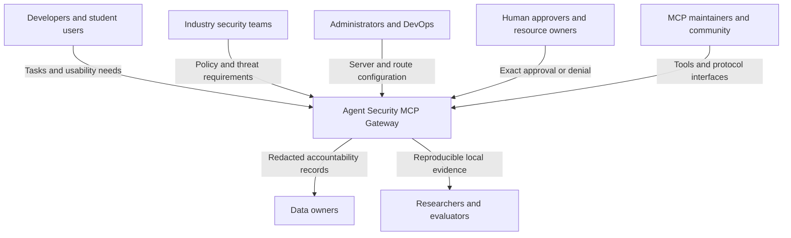
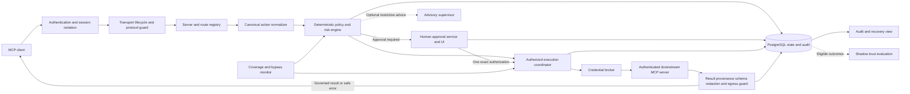
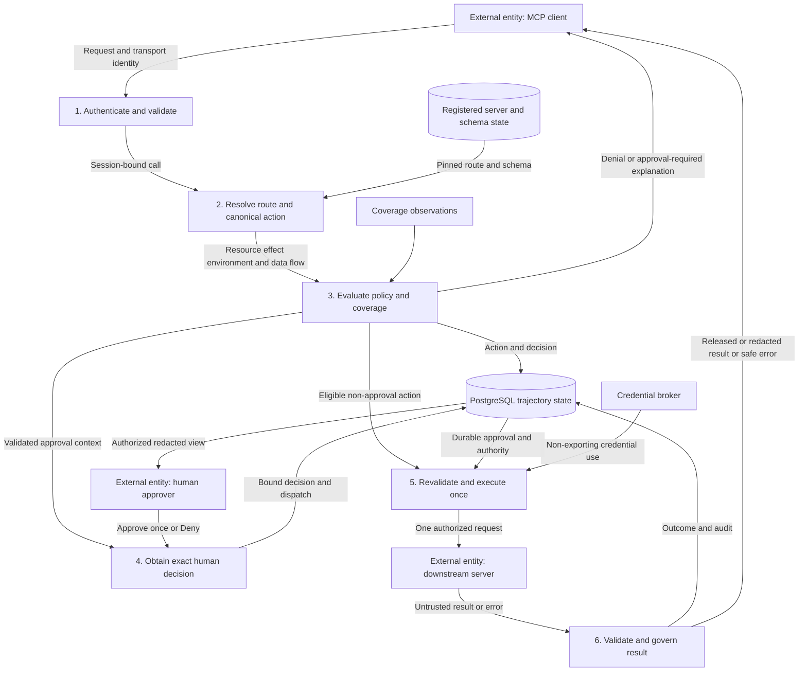
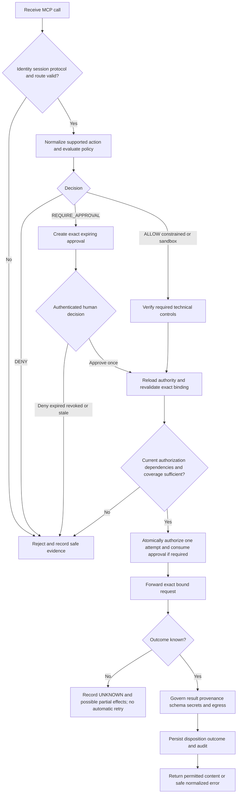
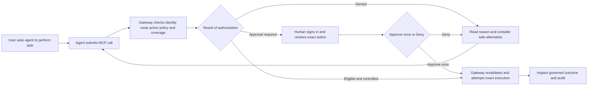
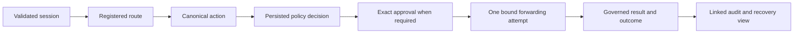
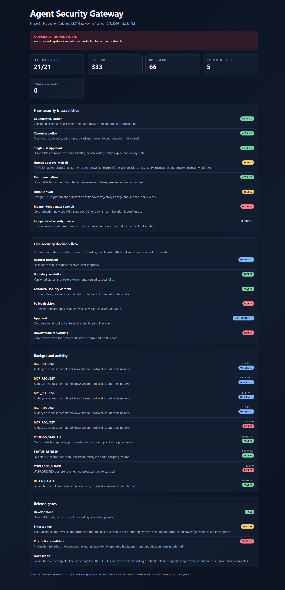
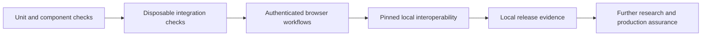

# Chapter 4: Stakeholder Survey and Requirement Analysis

## 4.1 Stakeholder Identification

The Agent Security MCP Gateway places a security boundary between an AI agent's Model Context Protocol (MCP) client and downstream tool servers. Stakeholders include people who request agent tasks, people who manage the connected resources, and people responsible for reviewing security decisions. Their needs concern both preventing harmful actions and keeping legitimate workflows usable.

| Stakeholder | Role in the system | Main needs | Requirement implications |
|---|---|---|---|
| Developers and student users | Use agents for development and tool-assisted tasks | Clear denials, predictable tool access, understandable approval requests | Structured decision explanations and safe alternatives |
| Industry security teams | Define policy and investigate misuse | Credential confidentiality, consistent authorization, evidence of blocked bypasses | Deterministic policy, credential custody, result governance, coverage checks |
| Administrators and DevOps teams | Register servers, maintain routes, operate services | Stable configuration, schema-change detection, failure diagnostics | Authenticated administration, route integrity, health and recovery reporting |
| Human approvers and resource owners | Decide whether a sensitive action may proceed | Exact target, effect, risk, expiry, and recovery information | Independently authenticated, action-bound, single-use approval |
| MCP server maintainers and open-source community | Provide tools and integrations | Protocol compatibility, clear interfaces, predictable error handling | Versioned contracts, transport adapters, integration tests |
| Researchers and academic evaluators | Assess the prototype and its security claims | Reproducible tests, transparent limitations, measurable outcomes | Disposable evaluation fixtures and complete request-to-outcome evidence |
| Data owners and affected users | Own information accessed through tools | Privacy, restricted data movement, accountable access | Session isolation, redaction, egress policy, audit linkage |



*Figure 4.1: Stakeholder relationships and their main interactions with the gateway. The diagram identifies intended participants; it is not evidence of completed interviews.*

## 4.2 Survey and Interview Design

### 4.2.1 Methodology

A mixed-method study is proposed: a short questionnaire identifies common priorities, and semi-structured interviews explain the reasons behind them. Recruitment should purposively cover agent users, security practitioners, administrators, approvers, and MCP maintainers. A practical pilot target is 20–30 questionnaire respondents and 5–8 interview participants, subject to availability. These numbers are recruitment targets, not achieved sample sizes. This sample would support formative design decisions rather than population-wide conclusions.

Before responding, participants should receive a brief explanation of MCP, the gateway's scope, and its approval workflow. The explanation must state that native shell, filesystem, browser, and direct network actions are outside the gateway unless independent controls block them. Participation should be voluntary; responses should use anonymous participant IDs and avoid credentials, private repositories, or production incident details. Only consented, anonymized material should appear in the report.

Use a five-point scale for rating questions: 1 = very low importance and 5 = very high importance. Include “not applicable” where appropriate, and exclude that response from the rating denominator. Report the valid response count for each question. Compare role groups descriptively, and code interview answers into themes such as approval clarity, workflow interruption, privacy, interoperability, and recovery.

### 4.2.2 Proposed Questionnaire

| ID | Question | Response format | Intended analysis |
|---|---|---|---|
| Q1 | What is your primary role? | User, security practitioner, administrator, approver, maintainer, researcher, other | Stakeholder distribution |
| Q2 | How often do you use AI agents with external tools? | Never, monthly, weekly, daily | Experience profile |
| Q3 | Which agent actions concern you most? | Multiple selection: deletion, credential access, data transfer, deployment, resource exhaustion, other | Frequency by concern |
| Q4 | How important is checking every tool call before execution? | Five-point importance scale | Priority for request mediation |
| Q5 | How important is inspecting results for sensitive data before returning them to the agent? | Five-point importance scale | Priority for result governance |
| Q6 | Which actions should always require human approval? | Multiple selection plus optional explanation | Approval expectations |
| Q7 | Which fields do you need before approving an action? | Select and rank: requester, target, effect, data flow, risk, reversibility, expiry, coverage | Approval-screen priorities |
| Q8 | What additional machine-processing delay would be acceptable for a tool call? | Under 100 ms, 100–500 ms, 500–1000 ms, over 1000 ms, depends on action | Candidate performance expectations |
| Q9 | How useful are an explicit denial reason and a safe alternative? | Five-point usefulness scale | Awareness and re-planning needs |
| Q10 | How important is showing missing protection guarantees and possible bypasses? | Five-point importance scale | Coverage-display priority |
| Q11 | Which platforms, MCP hosts, or server types should be supported first? | Short answer | Integration priorities |
| Q12 | After viewing the prototype, what was confusing or missing? | Open-ended response | Usability and improvement themes |

### 4.2.3 Interview Procedure

Each proposed interview should last approximately 15–20 minutes. Ask participants to describe a normal tool-assisted workflow, identify a harmful action they would want prevented, and review a disposable approval example. Ask them to explain the target and effect in their own words, choose approve or deny, and explain the choice. Finish by discussing interruption cost, error recovery, and what an `UNPROTECTED` label means to them. Record misunderstood fields and observed difficulties separately from opinions.

### 4.2.4 Results Presentation Plan

| Planned chart or table | Data required | Reporting rule |
|---|---|---|
| Stakeholder-role bar chart | Q1 category counts | Show count and valid sample size |
| Concern-frequency bar chart | Q3 selections | State that multiple selections are allowed |
| Stacked rating chart | Q4, Q5, Q9, Q10 response distributions | Include all five categories; disclose missing responses |
| Approval-field ranking table | Q7 rankings | Explain how ties and unranked fields are handled |
| Interview-theme table | Anonymized coded responses | Distinguish participant statements from researcher interpretation |

## 4.3 Survey Results and Current Evidence

No completed stakeholder questionnaire dataset, participant counts, interview transcripts, or collected feedback record was found in the active project documentation. Consequently, numerical survey findings and respondent charts cannot be reported. The table below is the current results status; it avoids presenting assumed preferences as measured findings.

| Survey outcome | Available result | Consequence for analysis |
|---|---|---|
| Invitations and participation | Not recorded | Response rate cannot be calculated |
| Stakeholder distribution | No collected dataset available | No role-distribution chart |
| Security concern ratings | Not measured | Priorities remain design assumptions |
| Approval clarity and fatigue | No participant measurements available | Human usability requires validation |
| Acceptable latency | Not measured | No stakeholder-approved performance threshold |
| Qualitative feedback | No interview record available | No attributed quotations or participant-derived themes |

The interim requirement analysis therefore uses the repository's technical specification, research synthesis, implementation, and test evidence. These sources establish engineering requirements, but they do not substitute for a stakeholder survey. The proposed study should validate the assumed user priorities before finalizing usability claims.

## 4.4 Key Insights Translated into Functional Requirements

The following insights are derived from project analysis. Their stakeholder relevance is inferred and remains subject to survey validation.

| ID | Project-derived insight | Functional requirement | Acceptance evidence or check |
|---|---|---|---|
| FR-01 | Model-controlled identity claims cannot establish authority | Authenticate clients outside tool arguments and isolate session state | Invalid identity and cross-session requests are rejected |
| FR-02 | Changing tool names or routes can conceal an equivalent effect | Resolve canonical resource, effect, environment, route, and data flow | Equivalent supported effects receive equally restrictive decisions |
| FR-03 | Sensitive actions need exact, reviewable authorization | Require single-use human approval or denial for every Tier 3 action | Changed, expired, replayed, or mismatched approval cannot execute |
| FR-04 | Approval must not defeat an immutable prohibition | Compose decisions as `DENY > REQUIRE_APPROVAL > SANDBOX > ALLOW_WITH_CONSTRAINTS > ALLOW` | A denial survives lower policy, trust, and supervisor inputs |
| FR-05 | A permitted call can return prohibited content | Check result provenance, schema, size, secrets, and egress policy | Invalid or sensitive results are denied, redacted, or quarantined |
| FR-06 | Discovery metadata and schemas may change or be hostile | Register routes administratively and quarantine unexpected drift | Ambiguous, unauthorized, or drifted routes cannot be used |
| FR-07 | Recovery requires durable evidence | Persist decisions, approvals, attempts, results, and audit linkage in PostgreSQL | Restart retains state; uncertain consumed attempts are not retried |
| FR-08 | Protocol misuse can create repeated effects or exhaustion | Enforce replay, quota, concurrency, recursion, cancellation, and timeout controls | Duplicate or excessive requests stop before unauthorized forwarding |
| FR-09 | Users need understandable decisions | Display canonical context, reason codes, safe alternatives, and recovery class | UI fields come from validated records; no raw secret exposure |
| FR-10 | Tool mediation alone does not prove protection | Display scoped coverage and missing guarantees; block protected mutations without verified enforcement | Bypass or absent assurance yields `DEGRADED` or `UNPROTECTED` |
| FR-11 | Credentials must remain outside agent-visible data | Use gateway-held, audience-bound, route-scoped credentials | Credentials do not appear in returned data, logs, or approval screens |
| FR-12 | Evidence should remain reproducible | Support disposable tests and correlated request-to-outcome inspection | Retained configuration, test logs, and observable downstream call counts |

Non-functional requirements include portability of the protocol core, strict boundary validation, maintainable module separation, accessible keyboard operation, bounded resource use, and redaction before storage or display. Runtime persistence must use PostgreSQL; in-memory stores are restricted to automated test fixtures. Performance targets require measurements and stakeholder confirmation.

# Chapter 5: System Design (Architecture + UI Plan)

## 5.1 System Architecture

The system is an external reference monitor for MCP traffic. It handles authenticated initialization, discovery, calls, and returned results. Protocol adapters translate transport details into versioned internal contracts; host-neutral components evaluate authority and govern effects. The local operational launcher deliberately remains non-forwarding. The architecture below describes the composed design and disposable enforcement workflows, not an enabled production deployment.



*Figure 5.1: Bidirectional gateway architecture. A denial ends execution. Other decisions proceed only when their technical restrictions, approval requirements, and coverage checks are satisfied. Trust and supervisor output cannot grant otherwise prohibited authority.*

## 5.2 Module Description and Responsibility Mapping

| Module / source area | Responsibility | Main interaction |
|---|---|---|
| `src/contracts/` | Strict versioned schemas for external and internal boundaries | Validates identity, calls, decisions, approvals, results, and trajectories |
| `src/transport/`, `src/protocol/` | Streamable HTTP, MCP lifecycle, replay and resource bounds | Delivers validated, session-bound requests to orchestration |
| `src/identity/` | Client authentication, isolated state, credential custody, Vault adapter | Supplies trusted principals and non-exporting credential use |
| `src/routing/` | Administrative server registration, discovery integrity, route resolution | Supplies one current server/tool/schema binding |
| `src/action-normalizer/` | Canonical resources, effects, data flow, category analyzers, workspace resolver | Converts supported requests into policy-relevant actions |
| `src/policy-engine/` | Risk tiering, immutable rules, restrictive decision composition | Produces versioned decisions and factual reasons |
| `src/approval/`, `src/runtime/` | Exact approval lifecycle, durable dispatch, call coordination | Revalidates authority and permits at most one gateway initiation |
| `src/forwarding/` | Bound downstream request and governed response | Checks request identity and result provenance, schema, and disposition |
| `src/persistence/`, `migrations/` | PostgreSQL transactions, durable state, linked audit | Persists request-to-outcome records and restart evidence |
| `src/coverage/` | Scoped assurance observations and bypass-aware assessment | Blocks protected mutations without verified coverage |
| `src/interfaces/`, `approval-ui/` | Canonical human approval, outcome, audit, recovery views | Shows exact action context and accepts authenticated decisions |
| `dashboard/`, `scripts/serve-dashboard.mjs` | Informational local status dashboard | Reads project metadata and local gateway telemetry |
| `src/trust/`, `src/supervisor/` | Shadow trust and optional restrictive model advice | Cannot override denial, Tier 3 approval, ambiguity, or missing coverage |
| `src/evaluation/`, `test/` | Seeded adversarial, integration, browser, and evidence checks | Evaluates safe behavior, attacks, concurrency, and failure handling |

The separation prevents transport-specific code or model-generated text from becoming policy authority. The dashboard is informational; it does not approve actions or enable forwarding.

## 5.3 Data Flow Diagram



*Figure 5.2: Logical data flow. Credentials and approval secrets never flow to the MCP client. Diagram stores are logical views; runtime records are persisted in PostgreSQL.*

## 5.4 Control Flow Diagram



*Figure 5.3: Request control flow. “Once” limits gateway initiation; it does not establish exactly-once execution inside an arbitrary downstream service.*

## 5.5 User Interface Wireframes and User Journey

### 5.5.1 Status Dashboard Wireframe

```text
+------------------------------------------------------------------+
| Agent Security Gateway                          Last refresh      |
+------------------------------------------------------------------+
| COVERAGE: UNPROTECTED                                             |
| Protected forwarding disabled | Missing guarantees listed below   |
+---------------+---------------+---------------+-------------------+
| Features      | Unit evidence | Integration   | Requests / calls  |
| complete      | count + date  | count + date  | local telemetry   |
+---------------+---------------+---------------+-------------------+
| Security controls: boundary, policy, approval, results, audit       |
| Current decision flow: admission -> decision -> forwarding state   |
| Recent activity: safe reason, outcome, timestamp                    |
| Release gates: local completion and deferred production assurance  |
+------------------------------------------------------------------+
```

*Figure 5.4: Dashboard wireframe. Counts and dates are evidence labels, not effectiveness scores. This is a layout plan, not a runtime screenshot.*

### 5.5.2 Human Approval Wireframe

```text
+-------------------------+----------------------------------------+
| Pending approvals       | Signed-in operator / authorized scope  |
| [Refresh]               +----------------------------------------+
| Request A               | Exact action ID | Status | Expiry      |
| Request B               | Requester: user / agent / client       |
| Request C               | Server / tool / route / environment    |
|                         | Canonical target and effect            |
|                         | Data flow and untrusted influence      |
|                         | Risk / blast radius / reversibility    |
|                         | Coverage and missing guarantees        |
|                         | Related attempts / recovery class      |
|                         +----------------------------------------+
|                         | [Deny]             [Approve once]      |
+-------------------------+----------------------------------------+
| Confirmation -> durable decision -> governed outcome -> audit     |
+------------------------------------------------------------------+
```

*Figure 5.5: Approval wireframe based on the implemented `approval-ui/index.html` sections. An immutable denial cannot be overridden. No bulk or permanent approval control is offered.*

### 5.5.3 User Journey



*Figure 5.6: Intended user journey and disposable approval workflow. The ordinary local launcher demonstrates admission and denial; it cannot execute protected actions.*

The UI should support keyboard navigation, visible focus, clear confirmation, loading and empty states, expiry indicators, and explicit stale-state errors. It should display canonical facts rather than model-authored summaries. Recovery information must distinguish a known failure from an uncertain outcome with possible partial effects.

## 5.6 Integration Plan

| Integration | Interface / tool | Responsibility and boundary |
|---|---|---|
| MCP client to gateway | Streamable HTTP and JSON-RPC with session/version headers | Authenticate outside arguments; negotiate the pinned protocol profile |
| Gateway to downstream server | Registered MCP route with pinned schemas | Authenticate the server and reauthorize every call |
| Gateway to PostgreSQL | `pg`, versioned SQL migrations, transactions | Durable authority, approvals, attempts, results, and audit; no runtime memory fallback |
| Human browser to approval API | Protected HTTPS/mTLS, session, origin, CSRF, and stale-state controls | Independently identify the human and authorize exact policy scope |
| Gateway to credential provider | Route/audience-bound broker and HashiCorp Vault adapter | Prevent credential export into agent-visible data |
| Dashboard to local gateway | Loopback status API | Display redacted telemetry; confer no execution authority |
| Tests to disposable dependencies | Embedded PostgreSQL, loopback peers, Chromium | Validate integration without real accounts or production data |
| Packaging to disposable container | Docker, SBOM, manifest and reproducibility scripts | Establish dated local release evidence; no publication or production assurance |
| Optional supervisor | Provider-neutral, schema-validated advisory interface | Receive redacted context; only preserve or tighten restrictions |

No specialized hardware is required. A Windows development computer runs the prototype, database fixtures, and browser. Resource requirements should be measured under the selected workload rather than presented as a verified minimum. Deployment integration must independently block native/direct bypasses before a protected path can qualify as `ENFORCED`.

# Chapter 6: Prototype Development (PoC)

## 6.1 Tools, Software, and Hardware Used

| Category | Prototype technology | Purpose |
|---|---|---|
| Implementation | Strict TypeScript and Node.js; package requires Node.js 24 or newer | Portable security logic and service runtime |
| HTTP service | Express | MCP and approval-related HTTP boundaries |
| Contract validation | Zod | Strict versioned payload and state validation |
| Persistence | PostgreSQL with `pg`; embedded PostgreSQL for tests | Transactional durable state and disposable integration evidence |
| Human interfaces | HTML, CSS, JavaScript | Local status dashboard and authenticated approval UI |
| Automated verification | Vitest, ESLint, TypeScript compiler | Unit/integration checks, lint, build, and type safety |
| Browser verification | Playwright with Chromium | Human decision workflows and screenshot capture |
| Credential integration | HashiCorp Vault provider and credential broker | Disposable provider checks and non-exporting credential use |
| Release verification | Docker, CycloneDX SBOM, hash manifest, reproducibility scripts | Local packaging, containment, and artifact evidence |
| Development hardware | General-purpose Windows workstation | Runs local processes and disposable dependencies; no physical sensor or actuator |

Versions and dependency constraints are maintained in `package.json` and the installed dependency lockfile. Tool availability alone does not establish production suitability.

## 6.2 Prototype Implementation Details

### 6.2.1 Core Functional Blocks

1. **Admission and initialization:** resolve trusted identity, create an isolated session, and validate MCP lifecycle and version headers before exposing discovery or accepting a call.
2. **Discovery and route integrity:** expose only authorized registered tools. Compute schema/integrity evidence and quarantine drift or ambiguous routes.
3. **Canonical policy:** represent resource, effect, environment, route, argument digest, and data flow. Apply immutable rules and risk tiers. Unknown or unsupported semantics cannot become a harmless-read allowance.
4. **Durable decision and approval:** persist the action and decision in PostgreSQL. Bind approval to the exact identity, session, action, route, resources, environment, and policy version, with a default five-minute expiry.
5. **Execution coordination:** reload current authority, enforce coverage and dependencies, claim dispatch, and atomically consume applicable approval. Initiate at most one exact credentialed downstream request.
6. **Result governance:** verify provenance, schema, size, redaction, and egress policy before releasing any result. Persist denial or quarantine without exposing raw unsafe content.
7. **Audit, recovery, and interfaces:** correlate decision, approval, attempt, result, and outcome. Show the governed state to the authorized human. Do not retry an ambiguous consumed attempt automatically.
8. **Evaluation controls:** calculate trust in shadow mode and keep optional supervisor advice restrictive. Neither changes an immutable denial or removes Tier 3 approval.



*Figure 6.1: Implemented prototype blocks in disposable enforcement workflows. The safe ordinary launcher stops protected tool execution before the forwarding block.*

### 6.2.2 Runnable Applications

The ordinary gateway launcher, `scripts/serve-gateway.mjs`, runs on loopback port 4174 and exposes `/mcp` and `/status`. It uses explicitly disposable fixture authentication, reports `UNPROTECTED`, and rejects tool execution. The dashboard, `scripts/serve-dashboard.mjs`, runs on loopback port 4173 and reads project metadata plus local gateway telemetry.

The protected approval launcher is a separate application. It requires configured human identity, PostgreSQL authority, credential-provider and runtime integrations. The ordinary gateway does not automatically create live approval requests. Governed approval, consumption, and result workflows are exercised by disposable integration/browser fixtures; they must not be represented as production protection.

## 6.3 Prototype Screenshots and Outputs

### 6.3.1 Current Local Dashboard Screenshot



*Figure 6.2: Actual screenshot of the running local dashboard captured on 3 October 2026 after the smoke workflow. It shows 21/21 locally complete feature records, `UNPROTECTED` coverage, five MCP requests, and zero downstream forwarded calls. The dashboard's integration counter shows retained metadata (66), whereas the fresh integration command passed 74 tests. Dashboard counters are not a new test runner result; the exact fresh outputs below are the validation evidence. The screenshot's displayed time follows the browser locale.*

The screenshot demonstrates the available interface, telemetry, and visible safety posture. The approval UI's “TESTED” label refers to retained disposable browser evidence, not a new approval run during this report task. The displayed development-gate label also does not supersede the known lint failure recorded in Chapter 7.

### 6.3.2 Observed Gateway Smoke Output

The following exact output was obtained from `npm run gateway:smoke` on 3 October 2026 against the disposable loopback launcher:

```text
Gateway smoke passed: unauthorized=401, initialize=200, initialized=202, tools/list=200, tools/call=200, downstreamToolsCalls=0.
```

The `tools/call=200` value is the HTTP transport status. The JSON-RPC body contains the expected denial; it is not successful tool execution. The smoke assertion also verifies `coverage=UNPROTECTED`, `forwardingEnabled=false`, and zero downstream calls. An empty registered discovery scope is expected in this launcher.

### 6.3.3 Observed Build and Test Outputs

These outputs were obtained during preparation on 3 October 2026:

```text
npm run build
> tsc -p tsconfig.json
[exit code 0]

npm run typecheck
> tsc -p tsconfig.json --noEmit
[exit code 0]

npm test
Test Files  33 passed (33)
     Tests  333 passed (333)

npm run test:integration
Test Files  16 passed (16)
     Tests  74 passed (74)

npm run validate:features
Validated 21 feature records for Phase 2.
```

The bracketed exit-code annotations are explanatory additions. The test and feature-summary lines reproduce the observed command output. Unit and integration tests initially encountered sandbox subprocess restrictions; permitted retries completed successfully. Lint was also run and failed on the two existing resolver-corpus diagnostics described in Section 7.3.

### 6.3.4 Retained Approval Workflow Outcomes

The 18 September 2026 checkpoint records four Chromium workflows for the functional approval application. This is retained evidence, not newly captured approval screenshots.

| Disposable scenario | Retained outcome |
|---|---|
| Human denies a pending action | Durable denial and no downstream execution |
| Human approves the exact eligible action | Atomic consumption and one governed downstream attempt |
| Duplicate decision or two-tab race | One winner; competing attempt cannot execute again |
| Approval expires or coverage is revoked | Execution blocked |
| Provider fails after initiation is possible | Conservative outcome, including `UNKNOWN` where partial effects are possible |
| Downstream result violates its schema | Quarantine displayed as a governed disposition |

## 6.4 Demo Methodology

The demonstration uses only disposable local resources. Start the ordinary gateway and dashboard in separate terminals, then run the smoke command in a third terminal:

```powershell
# Terminal 1
npm run gateway:serve

# Terminal 2
npm run dashboard:serve

# Terminal 3
npm run gateway:smoke
```

Open `http://127.0.0.1:4173/`. Present the architecture, explain the coverage banner, run the smoke workflow, and inspect the request activity and zero-forwarding counter. Demonstrate that invalid authentication is rejected, initialization succeeds, discovery is bounded to the configured registry, and a tool call receives a fail-safe denial.

For a separate approval demonstration, use the repository's disposable authenticated browser fixture through `npm run test:browser` with its required local dependencies available. Show exact approval context, human denial, one approved attempt, duplicate/replay rejection, and governed outcome. Explain the difference between this fixture and the ordinary non-forwarding launcher. Record command, configuration, result, and date for any new demonstration; this report task did not rerun the browser suite.

Demo success means observable behavior matches the expected assertions, not that the system is production-ready. After the presentation, stop local processes and retain only redacted evidence.

# Chapter 7: Testing and Interim Validation

## 7.1 Testing Strategy

The strategy combines component verification, real disposable integration boundaries, human-interface checks, and local release checks. Both legitimate requests and adversarial cases are necessary: blocking every call would prevent attacks while making the product unusable. Assertions inspect forwarding counts and linked outcomes, rather than final task success alone.

| Layer | Scope | Evidence sought |
|---|---|---|
| Unit/component | Contracts, identity, routes, normalization, policy, approval, results, coverage, trust | Correct positive and negative behavior for individual rules |
| Integration | Loopback MCP peers and disposable PostgreSQL | Durable decisions, session isolation, replay/concurrency, exact forwarding, recovery |
| Browser | Authenticated human approval UI | Live decision, reload, stale state, race, expiry, quarantine, accessible operation |
| Interoperability | Pinned MCP Everything and Microsoft Playwright MCP packages | Initialization, discovery, harmless selected calls, unknown-tool rejection |
| Deployment/release | Disposable hardened container and artifact scripts | Local containment, manifest identity, SBOM, reproducible build |
| Planned research evaluation | Independently labelled workloads and paired repeated trials | Prevention, false decisions, utility, latency, approval burden, bypass coverage |



*Figure 7.1: Cumulative validation layers. Later checks supplement earlier evidence; local completion does not satisfy independent research or production-assurance gates.*

## 7.2 Test Cases

| ID | Scenario / stimulus | Expected result | Evidence location |
|---|---|---|---|
| TC-01 | Invalid client identity or cross-session request | Reject without exposing another session's state | Identity and session unit/integration tests |
| TC-02 | Malformed payload or unknown contract version | Reject at the boundary | Contract and initialization tests |
| TC-03 | Duplicate tool route or changed schema | Reject ambiguity or latch quarantine | Downstream-registry and discovery tests |
| TC-04 | Replayed nonce/request, oversized payload, excessive concurrency | Deny before unauthorized invocation | Protocol-guard tests |
| TC-05 | Equivalent supported effect through alternative tool/path representation | Equally restrictive canonical decision | Canonical-policy and normalizer tests |
| TC-06 | Unknown or unsupported action semantics | Approval or denial; no keyword-absence allowance | Policy and required-analyzer tests |
| TC-07 | Tier 3 request with no exact valid approval | No forwarding | Approval and client-call tests |
| TC-08 | Expired, changed, cross-user, or already-consumed approval | No new forwarding attempt | Approval and PostgreSQL tests |
| TC-09 | Concurrent consumers or duplicate browser clicks | One atomic consumption winner; at most one initiation | Approval concurrency and browser fixtures |
| TC-10 | Database, identity, route, credential, or coverage dependency fails | Protected mutation blocked; safe evidence retained where possible | Persistence, coverage, provider, runtime tests |
| TC-11 | Result contains a secret, invalid schema, or disallowed data flow | Redact, deny, or quarantine before release | Forwarding/result-mediation tests |
| TC-12 | Crash after approval consumption with missing execution outcome | Record `UNKNOWN`; do not retry uncertain effects | Durable dispatch and recovery tests |
| TC-13 | Supervisor recommends permission or trust score rises | Immutable denial and Tier 3 approval remain unchanged | Supervisor and dynamic-trust tests |
| TC-14 | Ordinary launcher initializes, lists tools, and receives tool call | Lifecycle succeeds; tool execution denied; downstream count stays zero | Fresh local smoke workflow |
| TC-15 | Eligible safe task under controlled fixture authority | Complete through governed request/result path | Integration and seeded safe-workflow tests |

These cases summarize the test suite's intent. Passing a contract or injected-semantic test does not prove semantic resolution of every real tool language. Resolver ground truth and held-out families require independent review.

## 7.3 Results and Observations

### 7.3.1 Fresh Validation: 3 October 2026

| Check | Observed result | Interpretation |
|---|---|---|
| Build | Passed | Current source compiles |
| Type checking | Passed | Strict type checks complete |
| Unit suite | 33 files, 333 tests passed | Local component assertions pass |
| Integration suite | 16 files, 74 tests passed | Disposable protocol and database assertions pass |
| Feature validation | 21 records validated | Feature graph and records are valid; this is not a security score |
| Local smoke | Passed; zero downstream tool calls | Ordinary launcher remains non-forwarding |
| Dashboard capture | Captured and visually inspected | Running local UI and telemetry documented |
| Lint | Failed: two existing diagnostics | Full mandatory root validation is not wholly green |
| Browser, Vault, interoperability, container, release reruns | Not run for this task | Use only the dated retained evidence below |

Lint reports deprecated `finite` usage at line 79 and a numeric template-literal expression at line 110 in `src/evaluation/resolver-corpus-v1.ts`. These pre-existing implementation issues were preserved during this report-only task. Successful builds and tests do not erase the lint failure.

### 7.3.2 Retained Validation Checkpoints

| Date / checkpoint | Recorded outcome | Evidence limit |
|---|---|---|
| 18 September 2026 approval UI | Four Chromium workflows passed | Disposable human identity, database, and downstream fixtures |
| 20 September 2026 interoperability | MCP Everything: 13 advertised tools; Microsoft Playwright MCP: 26; selected harmless calls passed | Locally launched pinned packages, not independently operated hosts |
| 20 September 2026 release | 277 SBOM components, 138 manifest file hashes plus image identity, 264-file reproduced build | Local unsigned and unpublished artifacts |
| 20 September 2026 dependency audit | Zero reported vulnerabilities at that checkpoint | Historical audit result, not a current vulnerability assessment |
| 20 September 2026 container | No network or published ports, read-only root, non-root user, dropped capabilities, no-new-privileges | Disposable containment exercise, not production isolation |

### 7.3.3 Interim Interpretation

The results establish a runnable local PoC and tested security mechanisms for bounded disposable workflows. Atomic approval, session isolation, route integrity, fail-safe denial, and governed results have implementation evidence. All 21 local feature records remain complete under the approved non-production scope.

The results do not establish a real-world attack prevention rate, independently validated semantic accuracy, production exclusive mediation, or stakeholder acceptance. Test counts measure verification inventory; they are not survey results or percentages of attacks prevented. Coverage remains `UNPROTECTED`, and protected production forwarding remains disabled.

## 7.4 Feasibility Discussion: Performance, Constraints, and Risks

| Area | Interim feasibility assessment | Constraint or risk | Next validation |
|---|---|---|---|
| Technical implementation | TypeScript modules, loopback services, and PostgreSQL integrations run locally | Real deployments require configured authorities and custody | Independently operated integration environment |
| Performance | Component and integration workflows finish during local testing | No retained comparative latency distribution or acceptable user threshold | Measure p50/p95/p99, throughput, call amplification, and failure behavior |
| Human approval | Browser decision and concurrency mechanisms are implemented | Human response time, misunderstanding, and fatigue are unmeasured | Task-based stakeholder usability study |
| Semantic authorization | Canonical contracts and a bounded workspace resolver exist | Unsupported grammar, aliases, mutable resources, and candidate labels limit generalization | Independently reviewed labels and held-out equivalence families |
| Persistence and recovery | PostgreSQL records and conservative restart behavior are tested | Ambiguous downstream effects cannot be rolled back generically | Fault injection and workload-specific recovery drills |
| Security boundary | MCP requests and results are mediated in controlled workflows | Native/direct access may bypass the gateway | Independent network, IAM, OS, sandbox, and downstream controls |
| Interoperability | Two pinned open-source packages work in local checks | Package compatibility does not prove independent host operation | Repeated workflows on separately operated MCP hosts |
| Operational delivery | Local build and packaging evidence exists | Existing lint errors; no production review, signed release, or assurance | Resolve lint, external review, custody, signing, and deployment gates |
| Cost and hardware | No specialized hardware is needed for the local PoC | Provider cost and realistic workload resource use are unmeasured | Track CPU, memory, database load, and optional supervisor cost |

Measure gateway machine-processing latency separately from downstream execution and human approval wait time. Report workload, hardware, configuration, sample size, repeated trials, and uncertainty. A feasible local prototype can justify further evaluation without supporting production deployment claims.

## 7.5 Improvements Based on Stakeholder Feedback

There is no documented external stakeholder feedback dataset, so the changes below must not be described as participant-requested improvements. Existing improvements arose from engineering validation and project review; proposed improvements will be prioritized after the study in Chapter 4.

| Source / status | Improvement | Intended benefit | Verification |
|---|---|---|---|
| Implemented engineering review | Functional authenticated approval UI with canonical context | Better informed exact human decisions | Retained browser/PostgreSQL workflows |
| Implemented concurrency and recovery review | Durable dispatch claim, atomic consumption, conservative restart handling | Avoid duplicate attempts and unsafe retries | Race and recovery tests |
| Implemented result review | Display governed disposition and schema verdict without raw content | Avoid presenting quarantined results as safe completion | Result/browser fixtures |
| Implemented coverage review | Visible missing guarantees and disabled protected forwarding | Prevent misleading protection claims | Coverage and evidence-boundary tests |
| Proposed usability study | Simplify confusing approval fields while preserving canonical scope | Reduce decision mistakes | Comprehension checks and approval-error rate |
| Proposed operational feedback | Show validation dates and correct stale dashboard counters/gate labels | Prevent retained metadata being mistaken for fresh validation | Compare UI metadata with dated execution records |
| Proposed user feedback | Improve denial explanations and safe alternatives | Support legitimate re-planning | Completion under policy and repeated-risky-attempt rate |
| Proposed performance study | Profile deterministic checks and database transactions | Identify latency costs without weakening enforcement | Repeated p50/p95/p99 measurements |
| Proposed maintainer feedback | Validate additional pinned MCP integrations | Improve compatibility within explicit boundaries | Protocol, drift, route, and result tests |

For each collected issue, record an anonymous participant ID, task, observed difficulty, proposed change, requirement ID, and retest outcome. Changes must preserve immutable denials, exact Tier 3 approval, redaction, truthful coverage, and fail-safe dependency handling. Stakeholder evidence should determine usability priorities while security invariants remain mandatory.

Evidence for these chapters is drawn from the active [technical specification](docs/technical-specification.md), [feature tracker](docs/featurelist.json), [progress record](docs/progress.md), [project plan](docs/plan.md), [research synthesis](docs/research.md), and [research evaluation protocol](docs/research-protocol.md), alongside the fresh local command results and screenshot described above.
