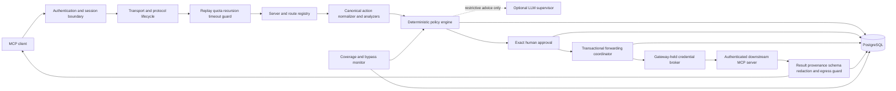
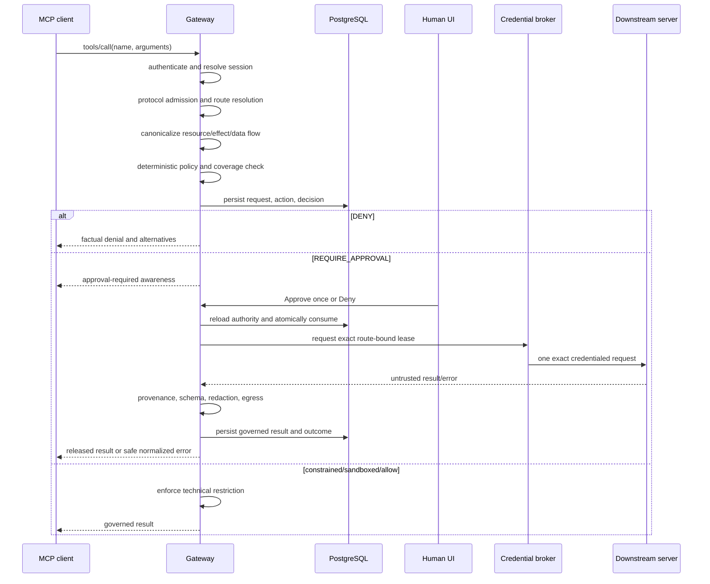

# Agent Security MCP Gateway — Technical Report

**Project phase:** Phase 2 — MCP security gateway

**Repository status:** Local non-production deliverable complete

**Report baseline:** 21 September 2026

**Technology:** TypeScript, Node.js 24+, Express 5, Zod 4, PostgreSQL, Vitest, Playwright

**Current coverage:** `UNPROTECTED`

**Production approved:** No

> This is a beginner-first guide to the active Phase 2 repository. It explains what
> the project is, why it exists, how requests move through it, how the source is
> organized, how to run and test it, and what is still required for production.
> The archived `phase-1/` tree is deliberately outside this report.

---

## 1. Executive summary

AI agents are no longer limited to producing text. Through the Model Context Protocol
(MCP), an agent can discover tools and ask servers to read files, query databases,
call APIs, or change external systems. That creates a security problem: model output,
tool descriptions, tool arguments, and tool results can all be wrong or hostile.

This project places a security gateway between an MCP client and downstream MCP
servers. The gateway behaves as a **reference monitor**: a control point through which
supported MCP operations must pass. It authenticates the caller, validates protocol
state, resolves the requested operation to a canonical resource and effect, applies
deterministic policy, asks a separately authenticated human for one exact approval
when necessary, forwards at most one authorized request using a gateway-held
credential, validates the downstream result, and writes a linked audit trajectory to
PostgreSQL.

The most important idea is that policy follows the **effect**, not the tool name. A
dangerous operation should remain dangerous when it is expressed through another
server, alias, path spelling, encoding, syntax, retry, or transport.

All 21 Phase 2 feature records are complete for the approved local, non-production
scope. The repository has substantial unit, integration, browser, PostgreSQL, Vault,
open-source MCP interoperability, container, SBOM, manifest, and reproducibility
evidence. That does **not** make it production-ready. No deployment has yet proved
that native shell, browser, filesystem, network, or direct-credential paths are
independently blocked. For that reason, the truthful global coverage remains
`UNPROTECTED`, and protected production forwarding remains disabled.

## 2. A five-minute mental model

Imagine an AI agent asks a database tool to delete a production table.

Without this gateway, the tool call may travel directly to the database server. A
prompt injection, model mistake, or stolen session could cause real damage.

With the intended gateway path:

1. The client is authenticated outside model-controlled JSON.
2. The MCP request is checked for correct lifecycle state, replay, quota, recursion,
   size, concurrency, and timeout limits.
3. A trusted registry resolves the public tool name to one exact server, route,
   schema, credential audience, environment, and policy scope.
4. A category analyzer converts the request into a canonical action such as
   “destructive mutation of production database resource X.”
5. Deterministic policy classifies it as Tier 3.
6. Tier 3 cannot run automatically. A human sees canonical facts and may select only
   **Approve once** or **Deny**.
7. Immediately before execution, the gateway reloads and revalidates every binding.
8. PostgreSQL atomically consumes the approval and creates one forwarding attempt.
9. Only then does the gateway obtain a short-lived, route-bound credential and send
   the exact registered request.
10. The response is treated as untrusted. Schema, provenance, size, secrets, egress,
    and content rules decide whether it is released, redacted, denied, or quarantined.
11. The proposal, decision, approval, forwarding attempt, result, outcome, recovery
    classification, and audit events remain linked.

If identity, policy, persistence, routing, parsing, approval, coverage, or a required
dependency is unavailable, sensitive or state-changing work fails closed.

## 3. MCP basics

### 3.1 Main actors

| Actor | Meaning in this project |
|---|---|
| User | The person who owns or initiates the task. |
| Agent | The AI-driven workload deciding which tool to call. |
| MCP host/client | The application that opens an MCP session and sends JSON-RPC requests. |
| Gateway | The trusted enforcement point implemented by this repository. |
| Downstream MCP server | A server that advertises and executes tools. |
| Human approver | A separately authenticated operator who can approve one exact action. |
| Protected resource | A repository, database, API, cloud object, account, or other valuable target. |

### 3.2 Simplified MCP lifecycle

The implementation pins MCP revision `2025-06-18`.

```text
client -> initialize request
gateway -> selected protocol version and supported capabilities
client -> notifications/initialized
client -> tools/list
gateway -> currently visible route-backed tools
client -> tools/call
gateway -> fresh authorization and, only when permitted, execution
```

Discovery is not authorization. A tool visible during `tools/list` may be unhealthy,
revoked, drifted, or forbidden by the time `tools/call` arrives, so the call is always
evaluated again.

### 3.3 Why MCP needs an external security boundary

MCP improves interoperability; it does not by itself prove that a model is authorized
to create an effect. Relevant threats include:

- direct, indirect, split, obfuscated, propagated, and tool-result prompt injection;
- malicious tool descriptions, schemas, resources, results, and errors;
- identity substitution, credential theft, session crossover, and replay;
- route collisions, server impersonation, capability drift, and schema drift;
- alternate tools or encodings that reproduce a denied effect;
- floods, recursion, retry storms, oversized payloads, and runaway concurrency;
- stale, broad, reusable, or concurrently consumed approvals;
- secret leakage through logs, databases, supervisors, UI, or returned content;
- dependency failure and ambiguous downstream outcomes; and
- direct paths around the gateway that make a protection claim false.

## 4. Scope, goals, and non-goals

### 4.1 What Phase 2 governs

- MCP initialization and capability negotiation;
- authenticated sessions and session-scoped state;
- downstream registration, discovery, schemas, and routes;
- tool-call validation, normalization, risk, and policy;
- exact human approval and one-time forwarding state;
- downstream results, errors, provenance, redaction, and egress;
- PostgreSQL audit, recovery, coverage, trust, and supervisor evidence;
- local evaluation, browser workflows, and non-production release evidence.

### 4.2 What it does not govern

The gateway does not mediate an agent's native shell, filesystem, browser, or direct
network activity. It does not replace IAM, network policy, operating-system controls,
sandboxing, backups, downstream authorization, or incident response. It cannot roll
back arbitrary remote actions automatically, and it must never use real production
credentials or data in development tests.

## 5. Security invariants

These rules are more important than any individual class:

1. Tier 3 requires one current, action-bound human approval or is denied.
2. Built-in and administrator denials cannot be weakened by trust, lower policy, or
   an LLM supervisor.
3. Missing risky keywords never implies safety. Unknown or partial analysis requires
   approval or denial.
4. Decisions compose by the following strict order:

   ```text
   DENY > REQUIRE_APPROVAL > SANDBOX > ALLOW_WITH_CONSTRAINTS > ALLOW
   ```

5. Policy follows canonical resource, effect, environment, route, and data flow.
6. Discovery filtering never replaces call-time authorization.
7. Results and errors are untrusted until governed.
8. Credentials and approval material never enter agent-visible data.
9. Non-`ENFORCED` coverage blocks protected mutations.
10. PostgreSQL is mandatory outside automated tests; there is no in-memory runtime
    fallback.
11. Known secrets are redacted before logs, audit, UI, errors, or supervisor input.
12. An unknown downstream outcome is recorded as possibly partially effective and is
    never retried automatically.

## 6. Architecture



The design separates protocol adapters from host-neutral security logic. This makes
the contracts, policy, approval, result, trust, and evaluation components reusable
across transports and MCP hosts.

## 7. End-to-end call flow

### 7.1 Request phase



### 7.2 Decision branches

| Decision | Meaning |
|---|---|
| `DENY` | The call must not execute. Approval cannot override it. |
| `REQUIRE_APPROVAL` | One exact human decision is needed before one attempt. |
| `SANDBOX` | Execute only inside a named, verifiable isolation profile. |
| `ALLOW_WITH_CONSTRAINTS` | Execute only after enforceable request/result restrictions are applied. |
| `ALLOW` | Execute because policy, parsing, scope, and coverage permit it. |

### 7.3 Risk tiers

| Tier | Typical meaning | Default treatment |
|---|---|---|
| 0 | Proven non-sensitive read with no egress or executable side effect | Allow only with verified scope and coverage |
| 1 | Reversible local write in an approved isolated development/test scope | Allow or constrain |
| 2 | Executable, networked, supply-chain, account, or meaningful state change | Sandbox, constrain, or require approval |
| 3 | Production, privileged, destructive, credential-related, broad, or hard to reverse | Exact approval or deny |

Unknown parsing can never become Tier 0 or Tier 1. Tests, linters, builds, and package
commands are at least Tier 2 when they can execute repository or dependency code.

## 8. Source modules

The public exports are collected in `src/index.ts`. The table below maps each source
area to its responsibility and important implementation objects.

| Path | Responsibility | Important objects |
|---|---|---|
| `src/contracts/` | Strict, versioned Zod schemas for every boundary | client/session/server/route, discovery, call, action, decision, approval, result, provenance, outcome |
| `src/protocol/` | MCP lifecycle and abuse controls | `transitionMcpLifecycleV1`, `DisposableProtocolGuardV1` |
| `src/transport/` | Streamable HTTP adapter and session/header binding | `createInitializationHttpAppV1` |
| `src/identity/` | Principals, session isolation, credential custody, mTLS, Vault | `ProtectedClientIdentityProviderV1`, `ProtectedCredentialBrokerV1`, `HashiCorpVaultKvV2ProviderV1` |
| `src/routing/` | Admin registration, discovery integrity, drift quarantine, exact route resolution | `DisposableDownstreamRegistryV1` |
| `src/action-normalizer/` | Canonical resources/effects/data flows and required category analyzers | `CanonicalActionNormalizerV1`, `RequiredAnalyzerRegistryV1` |
| `src/policy-engine/` | Risk tiering and most-restrictive policy composition | `DeterministicPolicyEngineV1` |
| `src/approval/` | Host-neutral exact approval lifecycle used by tests | `DisposableApprovalServiceV1` |
| `src/runtime/` | Client call orchestration, approved-call execution, UI bridge | `ClientToolCallCoordinatorV1`, `ClientApprovedCallExecutorV1`, `ApprovalWebRuntimeBridgeV1` |
| `src/forwarding/` | Exact HTTP/MCP forwarding and result governance | `ExactMcpHttpForwarderV1`, `DisposableExactForwarderV1` |
| `src/persistence/` | Migrations, trajectory store, identity, administration, approval UI state | `PostgresTrajectoryStoreV1` and related stores |
| `src/interfaces/` | Canonical approval/audit view, fatigue metrics, protected browser API | `TrustworthyInterfaceBuilderV1`, `createApprovalWebAppV1` |
| `src/coverage/` | Exclusive-mediation evidence and truthful coverage | `ExclusiveMediationMonitorV1`, `CoverageBoundPolicyEvaluatorV1` |
| `src/trust/` | Shadow-mode trust research and promotion gates | `DynamicTrustControllerV1` |
| `src/supervisor/` | Optional redacted advisory LLM boundary | `AdvisorySupervisorV1` |
| `src/evaluation/` | Seeded attacks, multi-host trials, external-evidence contracts | evaluation and evidence harnesses |

### 8.1 Contracts

Every external structure has a schema version, bounded fields, and strict unknown-field
handling. Major contracts include:

- `GatewayClientV1` and `GatewaySessionV1`;
- `DownstreamServerV1` and `ToolRouteV1`;
- `DiscoveryResultV1`, `ToolCallRequestV1`, and `RawToolResultV1`;
- `CanonicalActionV1` and `PolicyDecisionV1`;
- `ApprovalV1` and forwarding authorization;
- `DownstreamProvenanceV1` and `DownstreamResultV1`;
- `ExecutionOutcomeV1` and `RequestOutcomeTrajectoryV1`;
- `GatewayErrorV1` and `AwarenessV1`.

The schemas represent trusted state but do not create trust by themselves. Trusted
components must compute hashes, derive identity, resolve routes, enforce time, consume
approvals, and validate results.

### 8.2 Identity, sessions, and credentials

Identity is derived before MCP JSON parsing. The protected runtime uses mutual TLS and
resolves the certificate SHA-256 fingerprint against an append-only PostgreSQL
credential registry on every request. Registration, rotation, and revocation are
durable. A session binds user, agent, client, host, credential ID, and identity
revision. Cross-identity access returns the same generic response as an unknown
session, avoiding an existence oracle.

Credentials are not returned from the broker. Instead, a short-lived metadata lease
is bound to one session namespace, audience, route, endpoint origin, credential
revision, approval, action hash, and forwarding attempt. Secret bytes exist only
inside the non-redirecting credential-consuming sink and are zeroized in `finally`.
The concrete provider supports exact-version HashiCorp Vault KV v2 reads.

### 8.3 Discovery and routing

The registry pins authenticated server identity, protocol revision, capabilities,
tool names, input/output schema digests, audience, environment, and policy scope.
Unexpected drift latches the server or route into quarantine. Returning to the old
schema does not silently restore it; an authenticated administrator must review the
current state. Duplicate IDs, shadowed public names, cross-server bindings, and
ambiguous routes are rejected.

### 8.4 Protocol guard

Admission requires bounded timestamps, nonces, request IDs, and session-scoped replay
caches. Quotas can be applied by user, agent, client, session, server, tool, route,
destination, and action family. The guard also bounds payload/result size, call depth,
delegation depth, fan-out, concurrency, redirects, retries, and total execution time.
Ancestry detects recursion. Abort signals propagate cancellation, and circuit breakers
deny work while a required dependency is unhealthy.

### 8.5 Canonicalization and analyzers

Canonicalization recomputes the argument digest and byte length, verifies the current
route/schema/audience/scope, normalizes Windows/POSIX paths and URI components, records
data flow and call ancestry, and selects only the analyzer configured by the trusted
route. Eleven analyzer categories are required:

```text
filesystem, shell, Git, package, network, database, cloud,
browser, process, deployment, schema
```

Missing, failing, partial, version-mismatched, or category-substituted analysis becomes
an explicit unresolved action. The engine never guesses that it is safe.

### 8.6 Human approval and browser UI

An approval binds authenticated user, agent, client, session, action hash, argument
digest, server, tool, route, schema, audience, scope, resources, environment, data
flow, and policy version. It expires within five minutes and contains no credential or
approval token visible to the agent.

The protected browser UI:

- independently authenticates the human with mTLS;
- authorizes exact policy scopes from PostgreSQL;
- protects origin, CSRF token, browser session, ETag/stale state, and replay;
- presents canonical requester, target, risk, provenance, reversibility, blast radius,
  recovery, related attempts, coverage, and missing guarantees;
- offers only **Approve once** and **Deny**;
- reloads durable state after decisions and displays the governed outcome; and
- exposes no credential, raw untrusted error, or approval secret.

Approval and runtime dispatch are committed together. A worker claims the dispatch
before execution. Recovery revokes a stale unconsumed approval with zero forwarding.
If approval was consumed but no outcome exists, recovery records `UNKNOWN` with
possible partial effects and does not retry.

### 8.7 Result mediation

Every downstream result, error, resource, and metadata object remains untrusted. The
result guard binds it to authenticated server, route, schema, request, session,
action, and call chain; enforces size and schema; refuses redirects; classifies data;
redacts known secrets; applies egress policy; and marks released content as data rather
than instruction. Outcomes can be released, redacted, denied, or quarantined. A
quarantined result cannot create positive trust evidence.

### 8.8 Coverage

Coverage is not a client-supplied label. Trusted probes provide exact-scope evidence
for gateway, native, and direct paths. Evidence is checked for authority, verifier
class, scope, freshness, TTL, revision, rollback, and equivocation.

| State | Meaning |
|---|---|
| `ENFORCED` | Authenticated, policy-controlled, audited, fail-safe, and exclusively mediated |
| `DEGRADED` | One or more guarantees or bypass controls are incomplete |
| `OBSERVE_ONLY` | Traffic can be recorded but not reliably blocked |
| `UNPROTECTED` | No verified enforcing path exists |

Disposable evidence cannot establish deployment assurance. A reachable bypass
immediately degrades coverage and blocks mutations.

### 8.9 Dynamic trust and LLM supervisor

Dynamic trust begins in `SHADOW`: it computes research counterfactuals but cannot
change the authoritative decision. Promotion requires paired repeated trials and
thresholds for attacks, false allows, task completion, false denials, approval load,
latency, enforced coverage, and trust grinding. Tier 2/3, denial, ambiguity,
production, or non-enforced coverage remain ineligible. Audit gaps, identity changes,
route/schema changes, anomalies, and missing outcomes freeze trust.

The optional LLM supervisor receives only minimal allowlisted semantic context and
redacted, delimited untrusted fragments. It can recommend only `DENY` or
`REQUIRE_APPROVAL`; it cannot allow a call. Timeout, invalid output, low confidence,
provider failure, or audit failure falls back to deterministic policy or fails closed.

## 9. PostgreSQL data model

PostgreSQL is the durable source of truth. Migrations are forward-only and checksummed;
startup fails if persistence is unavailable.

| Migration | Main purpose |
|---|---|
| `0001_phase2_core.sql` | identities, clients, sessions, servers, routes, schemas, policies, requests, actions, decisions, approvals, forwarding, results, outcomes, audit, trust, coverage, violations, supervisor, recovery |
| `0002_exclusive_mediation_coverage.sql` | append-only coverage-control evidence and bypass events |
| `0003_trustworthy_interfaces.sql` | canonical interface views and approval-fatigue events |
| `0004_advisory_supervisor.sql` | append-only supervisor assessment constraints |
| `0005_protected_identity.sql` | durable client identity revisions and audit |
| `0006_protected_administration.sql` | append-only versioned server/route/schema/policy administration |
| `0007_approval_web_ui.sql` | human identities, scope grants, browser sessions, UI audit, approval state machine |
| `0008_approval_web_identity.sql` | approval-human identity binding additions |
| `0009_approval_runtime_authority.sql` | encrypted exact request payload required by approved execution |
| `0010_approval_runtime_dispatch.sql` | immutable dispatch/outbox state and recovery rules |

Important persistence properties:

- approval consumption and forwarding-attempt creation use a row-locked transaction;
- uniqueness constraints prevent a second forwarding attempt;
- security events form a SHA-256 chain and append-only triggers block updates/deletes;
- ordinary trajectory and UI rows omit raw arguments and result content;
- approved runtime arguments are separately encrypted with AES-256-GCM, a unique
  nonce, authentication tag, key ID, and request-bound additional data;
- the external 32-byte encryption key is never stored in PostgreSQL; and
- known configured secrets are rejected before any database query.

## 10. Runnable applications and interfaces

This repository is primarily a TypeScript security library plus executable adapters.
It does not contain a general-purpose chat frontend.

| Command/process | Address | What it does | Security posture |
|---|---|---|---|
| `npm run gateway:serve` | `http://127.0.0.1:4174/mcp` | Fixture-authenticated MCP lifecycle and registry-backed discovery | Local only, non-forwarding, `UNPROTECTED` |
| `npm run gateway:serve:protected` | HTTPS port 4174 by default | mTLS lifecycle endpoint with PostgreSQL identity | Protected identity profile; still `UNPROTECTED` |
| `npm run dashboard:serve` | `http://127.0.0.1:4173/` | Informational feature, validation, gate, and sanitized telemetry dashboard | Not an authorization surface |
| `npm run approval:serve:protected` | `https://127.0.0.1:4175/approval/` | mTLS human approval and audit UI backed by PostgreSQL and a trusted runtime module | Fails closed; disposable evidence only |

The default gateway accepts `Authorization: Bearer local-fixture`, supports MCP
initialization and discovery, and intentionally rejects operational forwarding. Its
`/status` endpoint is loopback-only and exposes sanitized counters, never arguments,
results, credentials, or approval material.

## 11. Repository map

```text
agent-security/
├── src/                 TypeScript security components
├── test/
│   ├── unit/            Pure/component/security-rule tests
│   ├── integration/     PostgreSQL and real boundary workflows
│   ├── browser/         Chromium approval UI workflows
│   └── fixtures/        Disposable clients and PostgreSQL helpers
├── migrations/          Forward-only PostgreSQL schema
├── scripts/             Servers, smoke, validation, evidence, release automation
├── approval-ui/         Protected human approval browser assets
├── dashboard/           Informational local status dashboard
├── infra/               Disposable PostgreSQL simulation
├── docs/                Authoritative specification, plan, research, and evidence
├── paper/               Research manuscript source
├── artifacts/           Generated local-only evidence; not production proof
├── Dockerfile.non-production
├── compose.non-production.yml
├── package.json
└── report.md            This report
```

Generated `dist/`, dependencies, local credentials, and scratch output are not source
of truth. The `phase-1/` directory is a closed archive and must not be used for normal
Phase 2 work.

## 12. Setup and quick start

### 12.1 Prerequisites

- Windows 10/11;
- Node.js 24 or later and npm;
- Git when working from source;
- PostgreSQL for protected runtime and persistence workflows;
- Docker Desktop with the Linux engine for optional release verification;
- Chromium installed by Playwright for browser tests; and
- HashiCorp Vault only for the disposable concrete-provider check.

### 12.2 Install and build

```powershell
cd V:\agent-security
npm ci
npm run build
```

### 12.3 Run the safe local demonstration

Terminal 1:

```powershell
npm run gateway:serve
```

Terminal 2:

```powershell
npm run dashboard:serve
```

Open `http://127.0.0.1:4173/`, then in Terminal 3 run:

```powershell
npm run gateway:smoke
```

Expected result: authentication checks and MCP lifecycle succeed, the tool call is
denied, coverage is `UNPROTECTED`, and downstream tool-call count remains zero.

### 12.4 Protected approval UI configuration

`npm run approval:serve:protected` requires:

| Variable | Purpose |
|---|---|
| `DATABASE_URL` | Reachable PostgreSQL connection string |
| `APPROVAL_UI_ORIGIN` | Exact HTTPS origin |
| `APPROVAL_UI_TLS_CERT_FILE` | Server certificate |
| `APPROVAL_UI_TLS_KEY_FILE` | Server private key |
| `APPROVAL_UI_CLIENT_CA_FILE` | CA for client-certificate authentication |
| `APPROVAL_UI_HUMAN_ID` | Trusted human ID |
| `APPROVAL_UI_HUMAN_IDENTITY_REVISION` | Positive durable revision |
| `APPROVAL_UI_RUNTIME_KEY_ID` | Runtime payload key identifier |
| `APPROVAL_UI_RUNTIME_KEY_BASE64` | Base64-encoded 32-byte AES key |
| `APPROVAL_UI_RUNTIME_MODULE` | Absolute trusted module exporting runtime dependencies |

The module must export `createProtectedApprovalRuntimeDependenciesV1` and return a
credential-lease issuer plus an exact forwarder. The human certificate credential and
scope grants must already exist in PostgreSQL. Missing or incomplete dependencies stop
startup rather than exposing a partially functional approval endpoint.

## 13. Testing strategy

The project tests both safe workflows and attacks.

### 13.1 Test layers

| Layer | Location | Purpose |
|---|---|---|
| Unit/component | `test/unit/` | Schemas, identity, routes, policy, approval, result, coverage, trust, supervisor, evidence contracts |
| Integration | `test/integration/` | Real loopback HTTP, disposable PostgreSQL, replay/concurrency, persistence, forwarding, coverage, Vault-related composition |
| Browser | `test/browser/` | Live Chromium approval/denial, reload, races, expiry, revocation, provider failure, quarantine |
| Interoperability | `scripts/verify-open-source-mcp-servers.mjs` | Pinned MCP Everything and Microsoft Playwright MCP servers |
| Deployment/release | scripts plus Docker | Hardened disposable container, SBOM, manifest, reproducibility, dependency audit |

The latest authoritative evidence records 32 unit files/295 tests, 15 integration
files/66 tests, four browser workflows, and all 21 feature records passing. Those
counts are a dated evidence snapshot, not a substitute for rerunning validation after
changes.

### 13.2 Mandatory validation

```powershell
npm run build
npm run lint
npm run typecheck
npm test
npm run test:integration
npm run validate:features
```

For approval UI changes, also run:

```powershell
npm run test:browser
```

### 13.3 What the security suites cover

- protocol replay, flooding, recursion, cancellation, drift, collision, impersonation,
  audience binding, and dependency failure;
- equivalent tools, servers, paths, encodings, transports, retries, split payloads,
  concurrency, and time-of-check/time-of-use;
- direct, indirect, obfuscated, propagated, tool-description, and tool-result
  injection; and
- approval fatigue, misleading context, safe replanning, trust grinding, identity
  changes, audit gaps, delayed harm, and anomaly freezes.

## 14. Local release and operational evidence

Run the full local non-production preparation with Docker available:

```powershell
npm run release:prepare:non-production
```

It performs repository validation, package-boundary verification, dashboard and SBOM
generation, hardened container build/smoke, manifest generation/verification,
reproducible-build verification, and dependency audit.

The verified disposable container uses:

- `network=none`;
- no published ports;
- a read-only root filesystem;
- all Linux capabilities dropped;
- `no-new-privileges`; and
- a non-root user.

The latest evidence records a 277-component CycloneDX SBOM, 138 release-manifest file
hashes plus image identity, a reproducible 264-file generated build, and zero npm audit
vulnerabilities. Artifacts are unsigned, unpublished, local-only, not
production-approved, and ineligible to establish `ENFORCED` coverage.

Useful commands:

```powershell
npm run mcp-servers:verify:disposable
npm run vault:verify:disposable
npm run deploy:verify:non-production
npm run sbom:generate
npm run release:manifest
npm run release:verify
npm run build:verify-reproducible
npm run evidence:capture
```

## 15. Feature and milestone status

All 21 tracked feature records are `complete` under the local non-production scope.

| Milestone | Features | Result |
|---|---|---|
| 1 — Protocol foundation | P2-F001–F004 | Contracts, lifecycle, identity, routes, protocol abuse controls |
| 2 — Authorization monitor | P2-F005–F006 plus persistence decisions | Canonical policy and exact approval |
| 3 — Execution boundary | P2-F007–F010 | Results, PostgreSQL, coverage, trustworthy interfaces |
| 4 — Evaluation | P2-F011–F012 | Seeded suites and multi-host isolation harness |
| 5 — Research controls | P2-F013–F014 | Shadow trust and restrictive advisory supervisor |
| 6 — Operational integration | P2-F015–F020 | Client composition, production-shaped adapters, open-source interoperability, release evidence, functional approval UI |

“Complete” here means the acceptance criteria for the approved local scope have
evidence. It does not mean a production deployment exists.

## 16. Current limitations and production gates

Production approval is blocked/deferred until all of the following exist:

1. Independent security review with findings resolved or formally accepted by a
   different authorized risk owner.
2. Validation with independently operated MCP hosts, not merely locally launched
   open-source packages.
3. Adaptive repeated-trial evaluation with retained baselines and metrics.
4. Deployment evidence that network, IAM, sandbox, OS, and downstream controls block
   direct or alternate access around the gateway.
5. Production credential custody and operational ownership.
6. Exercised production incident response, recovery objectives, upgrade, and rollback.
7. Reproducibly signed and published artifacts and SBOM.

Until these exist, the correct claim is:

> The repository demonstrates fail-closed MCP mediation with disposable local
> resources. It does not demonstrate production protection or exclusive mediation.

## 17. How to read the code as a beginner

Follow one concept at a time:

1. Read `src/contracts/v1.ts` and `src/contracts/boundary-v1.ts` to learn the data
   shapes.
2. Read `src/protocol/initialization-v1.ts` and its unit test to understand MCP state.
3. Read `src/transport/streamable-http-initialization-v1.ts` to see HTTP/session wiring.
4. Read `src/routing/downstream-registry-v1.ts` for discovery and route integrity.
5. Read `src/action-normalizer/canonical-action-v1.ts`, then
   `src/policy-engine/deterministic-policy-v1.ts`.
6. Read `src/runtime/client-tool-call-v1.ts` for orchestration.
7. Read `src/persistence/postgres-trajectory-store-v1.ts` beside the migrations.
8. Read `src/interfaces/approval-web-v1.ts` and
   `src/runtime/approval-web-runtime-v1.ts` for human approval.
9. Read `src/forwarding/disposable-forwarding-v1.ts` for exact forwarding and result
   mediation.
10. Finish with coverage, trust, supervisor, and evaluation modules.

For each file, read the matching unit test before the integration test. The tests are
executable examples of required behavior and failure behavior.

## 18. Safe development workflow

1. Read `docs/AGENTS.md` and the authoritative documents in its required order.
2. Confirm the relevant feature criteria and current evidence.
3. Inspect the implementation and tests; do not infer behavior from names.
4. Make one coherent vertical change.
5. Validate external input before internal processing.
6. Add safe, attack, dependency-failure, replay/concurrency, and equivalent-effect
   tests as applicable.
7. Run focused tests, then the complete validation ladder.
8. Update `docs/progress.md` and `docs/featurelist.json` with exact evidence and risks.
9. Never weaken a policy, parser, assertion, or security invariant just to pass tests.

Do not use real production credentials, data, services, databases, or MCP servers.

## 19. Common troubleshooting

### Installation fails

Confirm Node.js 24+, run from the repository root, and preserve `package-lock.json`.
Use `npm ci`, not an unlocked dependency install.

### PostgreSQL integration tests fail

The tests use disposable PostgreSQL. Check blocked ports, antivirus locks, and stale
test processes. Windows may occasionally produce an `EBUSY` cleanup race after tests;
a failed invocation is still a failure and must be rerun after the lock clears.

### A mutation is denied unexpectedly

Check parsing status, route/schema health, policy reasons, exact coverage scope,
evidence freshness, and direct/native bypass reachability. Under current global
`UNPROTECTED` coverage, denial is expected.

### The approval service refuses to start

Verify every required environment variable, mTLS file, PostgreSQL connection, 32-byte
runtime key, human scope grant, and absolute trusted runtime module. Fail-closed
startup is intentional.

### Dashboard shows no activity

Run `gateway:serve`, then `gateway:smoke`, and refresh the dashboard. The dashboard is
informational and does not create authorization state.

### Docker reports a stale Windows socket

Follow `startup.md` and `docs/operations/recovery-and-rollback.md`. Preserve and rename
only the affected ephemeral socket directory after Docker is fully stopped; do not
factory-reset Docker or broadly delete containers, volumes, or workspace data.

## 20. Frequently asked questions

### Why not let the AI decide what is safe?

The model is part of the untrusted decision environment and can be manipulated. It may
provide evidence, but enforceable authorization must be deterministic and external.

### Why inspect results after an authorized call?

Authorization to read data is not authorization to release every byte to the agent.
Results can contain secrets, invalid structures, redirects, or prompt injection.

### Why is human approval not enough?

Approval can be stale, misleading, broad, replayed, or raced. This design binds it to
one exact current action and consumes it atomically.

### Why PostgreSQL rather than memory?

Approval and forwarding safety must survive restarts and multiple processes. Database
transactions, row locks, constraints, and append-only triggers provide durable replay
and concurrency resistance.

### Why is coverage `UNPROTECTED` after all features passed?

Feature completion proves local component behavior. Coverage asks a different
question: can the agent reproduce the protected effect through another path? Without
independent deployment controls, the honest answer is still yes or unverified.

### Can trust or the supervisor approve Tier 3?

No. Trust is shadow/counterfactual, and the supervisor can only add restriction.

## 21. Glossary

| Term | Plain meaning |
|---|---|
| Canonical action | Stable security representation of the real resource, effect, environment, route, and data flow |
| Circuit breaker | Stops work when a required dependency is unhealthy |
| Coverage | Evidence describing whether an exact path is genuinely protected |
| Egress | Data leaving one trust boundary for another |
| Fail closed | Deny or stop when required security facts are missing |
| MCP | Model Context Protocol, a standard for connecting AI hosts to tools/resources |
| mTLS | Mutual TLS; both parties authenticate with certificates |
| Nonce | One-time value used to detect replay |
| Provenance | Evidence about where a result came from and which request produced it |
| Quarantine | Withhold invalid or unsafe content pending review |
| Reference monitor | A trusted component that mediates security-relevant operations |
| Route | Trusted mapping from an exposed tool to one server/tool/schema/audience/scope |
| SBOM | Software Bill of Materials |
| Shadow mode | Compute research output without changing authorization |
| Trajectory | Linked request, decision, approval, execution, result, and outcome history |
| Zod | Runtime schema-validation library used at TypeScript boundaries |

## 22. Authoritative references

When details conflict, use these project sources in this order:

1. `docs/technical-specification.md`
2. `docs/featurelist.json`
3. `docs/progress.md`
4. `docs/plan.md`
5. `docs/research.md`

Operational companions:

- `startup.md` — step-by-step startup, demos, and troubleshooting;
- `docs/release-gate-audit.md` — local versus production gate evidence;
- `docs/operations/recovery-and-rollback.md` — safe local recovery;
- `docs/security-review-packet.md` — future independent review scope; and
- `docs/AGENTS.md` — repository working and validation rules.

## 23. Final conclusion

The Agent Security MCP Gateway is an effect-based, bidirectional security boundary for
MCP traffic. Its architecture combines strict contracts, authenticated sessions,
integrity-checked routing, abuse-resistant protocol handling, canonical deterministic
policy, exact human approval, gateway-held credentials, governed results, durable
PostgreSQL trajectories, truthful coverage, and reproducible evaluation.

The local Phase 2 engineering work is complete and extensively exercised. The most
important remaining lesson is also a security property: tested components do not
justify a production-protection claim. Until independent isolation, review,
credential custody, operational recovery, host evidence, and signed release evidence
exist, the project must remain `UNPROTECTED` and production forwarding must remain
disabled.

The package metadata names Apache-2.0 as the target license, but no root license file
currently grants that license. Do not assume redistribution permission beyond rights
explicitly provided by the repository owner.
