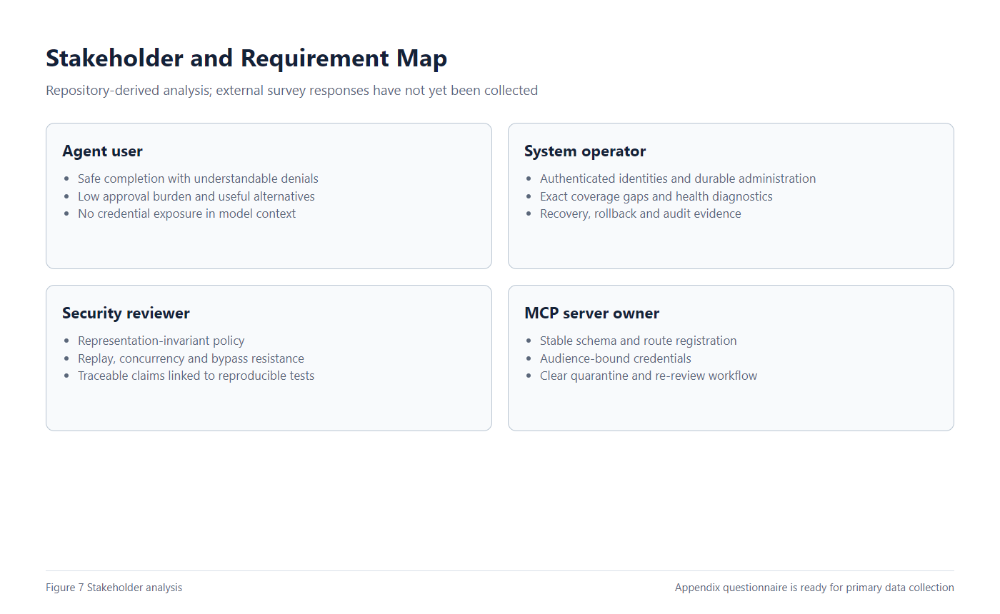
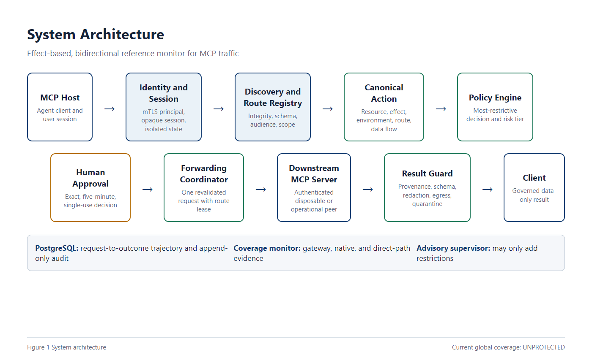
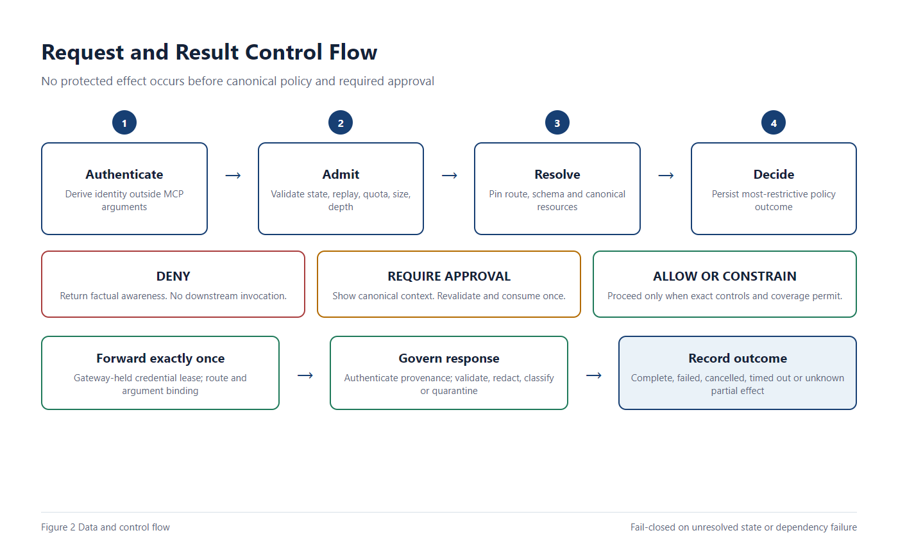
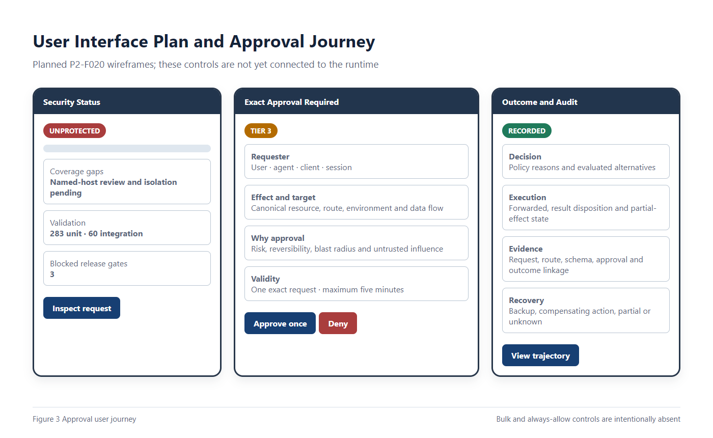
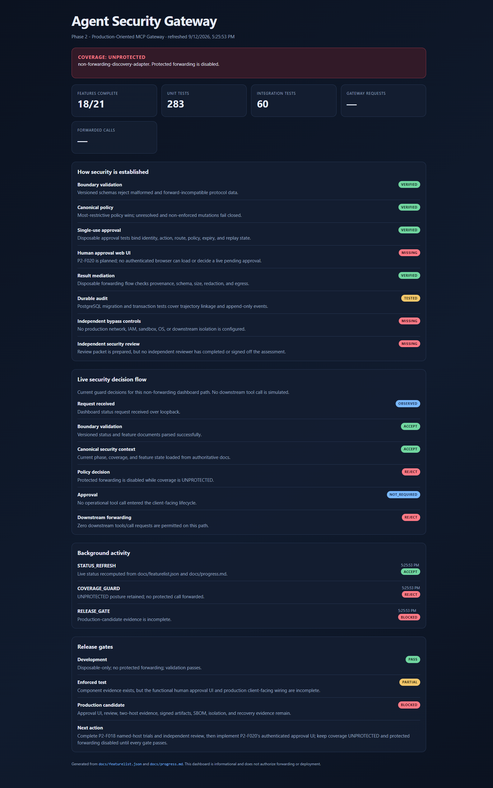
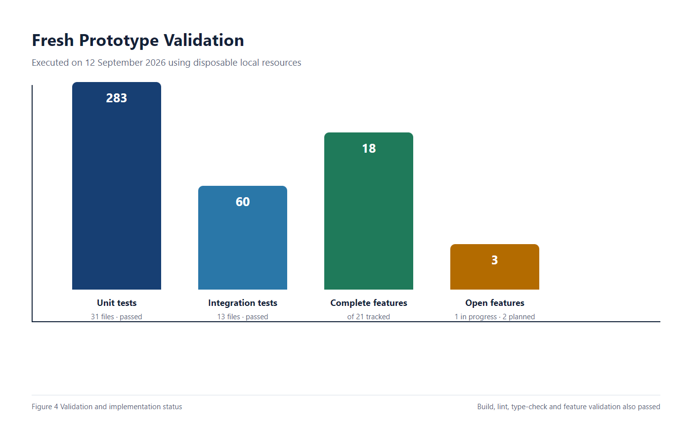
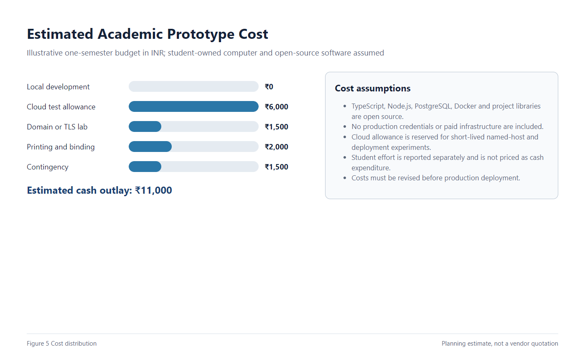
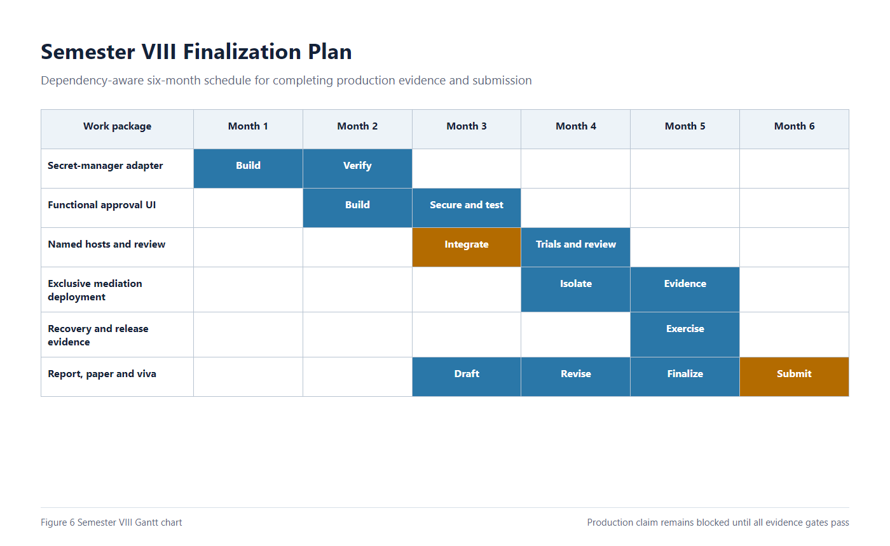

# Agent Security MCP Gateway

## Semester VII Project Report

**Submitted by:** [Student Name 1 — Roll Number]  
**Team members:** [Student Name 2 — Roll Number], [Student Name 3 — Roll Number]  
**Project guide:** [Guide Name and Designation]  
**Department:** [Department Name]  
**College:** [College Name]  
**University:** [University Name]  
**Academic year:** 2026–2027  
**Submission date:** [DD Month YYYY]

> Replace every square-bracketed field before submission. The technical content reflects the Phase II repository state verified on 12 September 2026.

---

## Bonafide Certificate

This is to certify that the project report entitled **Agent Security MCP Gateway** is a bonafide record of the work carried out by **[Student names and roll numbers]**, students of **[Department]**, **[College]**, during the academic year **2026–2027**, under the guidance and supervision of **[Guide name]**. The work presented in this report is submitted in partial fulfilment of the requirements for the Semester VII project review.

The project work documented here has been reviewed for its stated scope, implementation evidence, and academic presentation. The authors remain responsible for replacing all identity placeholders, attaching institution-specific proof, and obtaining the required signatures before submission.

| Project Guide | Head of Department | Internal Examiner | External Examiner |
|---|---|---|---|
| Signature: __________ | Signature: __________ | Signature: __________ | Signature: __________ |
| Name: [Guide] | Name: [HoD] | Name: [Examiner] | Name: [Examiner] |
| Date: __________ | Date: __________ | Date: __________ | Date: __________ |

---

## Acknowledgement

We express our sincere gratitude to **[Guide name]**, our project guide, for reviewing the technical direction of this work and helping us organise the project into measurable stages. We thank **[Head of Department]**, the faculty members of **[Department]**, and **[College]** for providing the academic environment and facilities needed to carry out the prototype and its evaluation. We also acknowledge the maintainers and researchers behind the Model Context Protocol specification, Node.js, TypeScript, PostgreSQL, Express, Zod, Vitest, and the academic studies cited in this report. Their openly available specifications, software, and research made it possible to study agent-tool security through a reproducible prototype. Finally, we thank our classmates, reviewers, and family members for their feedback and support during the development and documentation of this work.

---

## Abstract

Tool-using artificial-intelligence agents can read files, call services, modify databases, and trigger other real-world effects. The Model Context Protocol makes these integrations interoperable, but it also allows untrusted clients, tool descriptions, arguments, results, and protocol state to influence an agent. This project develops an **Agent Security MCP Gateway**, a fail-closed reference monitor placed between an MCP host and downstream tool servers. The prototype authenticates clients, isolates sessions, integrity-checks discovery, converts surface-level tool calls into canonical resources and effects, and applies deterministic policy using a most-restrictive-wins rule. High-risk Tier 3 operations require one human approval bound to the exact identity, session, action, route, schema, resources, environment, and policy version. After approval, the system can consume the decision once, use a gateway-held route credential, validate downstream provenance, redact sensitive content, enforce egress policy, and store a linked PostgreSQL audit trajectory. A separate coverage monitor prevents the system from claiming protection when native or direct bypass paths remain available. Fresh verification on 12 September 2026 passed the TypeScript build, lint, type-check, 283 unit tests, and 60 integration tests. The plan tracks 21 features: 18 complete, one in progress, and two planned. An approved HashiCorp Vault adapter now supplies exact-revision credentials in disposable tests; functional approval UI, complete named-host trials, independent review, and production isolation evidence remain. Therefore, the present result is a strong disposable prototype, not a production security product, and its global coverage is correctly reported as `UNPROTECTED`.

**Keywords:** Model Context Protocol, AI agent security, reference monitor, authorization, prompt injection, human approval, audit, zero trust

---

## Table of Contents

1. [Introduction](#chapter-1-introduction)
2. [Problem Statement and Objectives](#chapter-2-problem-statement-and-objectives)
3. [Literature Survey Summary](#chapter-3-literature-survey-summary)
4. [Stakeholder Survey and Requirement Analysis](#chapter-4-stakeholder-survey-and-requirement-analysis)
5. [System Design](#chapter-5-system-design)
6. [Prototype Development](#chapter-6-prototype-development)
7. [Testing and Interim Validation](#chapter-7-testing-and-interim-validation)
8. [SDG Relevance and Cost Analysis](#chapter-8-sdg-relevance-and-cost-analysis)
9. [Summary and Plan for Semester VIII](#chapter-9-summary-and-plan-for-semester-viii)
10. [References](#references)
11. [Appendices](#appendices)

## List of Figures

| Figure | Title |
|---:|---|
| 1 | System architecture of the Agent Security MCP Gateway |
| 2 | Request and result control flow |
| 3 | User interface plan and exact-approval journey |
| 4 | Fresh prototype validation and implementation status |
| 5 | Estimated academic prototype cost distribution |
| 6 | Semester VIII finalization plan |
| 7 | Stakeholder and requirement map |
| 8 | Actual local status dashboard captured from the running prototype |

## List of Tables

| Table | Title |
|---:|---|
| 1 | Phase II objectives and measurable outcomes |
| 2 | Literature and product comparison |
| 3 | Stakeholder groups and principal needs |
| 4 | Derived functional requirements |
| 5 | Derived non-functional and security requirements |
| 6 | Module responsibility mapping |
| 7 | Technology and tool stack |
| 8 | Representative test cases and observations |
| 9 | Feasibility and risk analysis |
| 10 | SDG mapping |
| 11 | Cost estimate |
| 12 | Semester VIII milestones and completion evidence |

---

# Chapter 1 Introduction

## 1.1 Background and Motivation

Large language models are increasingly used as agents that can select tools, invoke APIs, read external data, and continue a task across several steps. In a conventional chatbot, a wrong answer normally remains text. In a tool-enabled agent, an incorrect or manipulated decision may change a repository, disclose private data, alter a database, create cloud resources, or communicate with an external account. The security boundary must therefore surround the agent’s effects, not only its generated words.

The Model Context Protocol (MCP) defines interoperable communication between hosts, clients, and servers. Its 2025-06-18 specification covers initialization, capability negotiation, discovery, tool invocation, resources, protocol state, and transports [1], [2]. Interoperability improves reuse, but it also introduces trust questions. A malicious server can publish misleading descriptions; a compromised data source can return hidden instructions; a client can replay a request; two tools can express the same dangerous effect using different names; and an agent may bypass a gateway by using a native shell or direct network path.

The project is motivated by a central systems-security observation: prompt filtering and model alignment do not provide complete mediation. Authorization should be evaluated outside the model, using authenticated identity and the actual resource, effect, environment, route, and data flow. The response path must also be governed because an authorized read can return secret data or instructions designed to trigger a later unsafe action.

## 1.2 Need for the Solution

The gateway is intended for teams that connect AI agents to repositories, databases, cloud services, internal APIs, deployment tools, and other MCP servers. These users need a control point that can:

- identify the user, agent, client, host, and session without trusting model-supplied fields;
- prevent a tool rename, alternate path, encoding, retry, or server switch from weakening policy;
- require understandable human confirmation for high-impact actions;
- stop replay, recursion, concurrency abuse, oversized payloads, and unsafe dependency failures;
- inspect the result before it returns to the model;
- preserve evidence linking a request to its decision, approval, forwarding attempt, result, and outcome; and
- report honestly when the gateway can be bypassed.

The last requirement is important. A gateway cannot claim to protect a database if the agent still holds a direct database credential. This project therefore separates **gateway behavior** from **exclusive-mediation evidence**. The system reports `ENFORCED` only when the MCP path and the independently controlled native/direct paths satisfy the required guarantees.

## 1.3 Phase II Objectives and Expected Outcomes

Table 1 maps the Phase II objectives to evidence available in the current repository.

| Objective | Measurement | Current outcome |
|---|---|---|
| Define strict MCP boundary contracts | Unknown fields and versions fail validation | Implemented and unit-tested |
| Authenticate clients and isolate sessions | Cross-session access and identity substitution are denied | Implemented; protected mTLS profile exists |
| Preserve discovery and route integrity | Drift, collisions, unavailable routes, and unauthorized routes fail closed | Implemented |
| Canonicalize equivalent effects | Equivalent paths, aliases, encodings, routes, and transports receive equally restrictive decisions | Implemented for tested representations |
| Enforce deterministic risk policy | Most-restrictive composition; no keyword-absence allow path | Implemented |
| Require exact Tier 3 approval | Five-minute maximum, single-use, action-bound approval | Implemented in disposable and PostgreSQL-backed flows |
| Mediate downstream results | Provenance, schema, size, redaction, egress, and quarantine | Implemented |
| Maintain durable accountability | Transactional PostgreSQL request-to-outcome linkage and append-only events | Implemented |
| Measure security and usability | Versioned seeded suites and repeated-trial metrics | Harness implemented; production-grade trials pending |
| Establish production protection | Approved secret manager, named hosts, independent review, bypass controls, signed release | Not complete; global coverage remains `UNPROTECTED` |

## 1.4 Scope

The active scope is Phase II MCP traffic. It includes initialization, discovery, tool-call requests, approvals, forwarding state, returned content, errors, cancellation, audit, trust evidence, and coverage reporting. The implementation uses strict TypeScript, Node.js, Express-facing adapters, Zod contracts, and PostgreSQL persistence. Automated evaluation uses only disposable local resources.

The project does not claim to mediate a coding agent’s native shell, filesystem, browser, or direct network actions. It also does not replace operating-system controls, network policy, IAM, downstream authorization, backups, sandboxing, or incident response. These controls become evidence inputs to the coverage monitor when a deployment seeks `ENFORCED` status.

## 1.5 Limitations

- The current global coverage state is `UNPROTECTED`.
- An approved HashiCorp Vault KV v2 adapter has been exercised through the credential broker using a real disposable Vault development server; production Vault custody and isolation remain unverified.
- Current multi-host evidence uses synthetic adapters rather than two named independently operated MCP host products.
- Independent security review and production bypass-control evidence are pending.
- The seeded evaluation catalog validates harness mechanics and supplied evidence; it is not yet an empirical attack-prevention study across live adaptive agents.
- No external stakeholder survey or human-subject approval-fatigue study has been completed. This report provides the instrument and analysis plan without inventing responses.
- Cost estimates are academic planning assumptions, not vendor quotations.

---

# Chapter 2 Problem Statement and Objectives

## 2.1 Final Problem Statement

An MCP-enabled AI agent may receive hostile instructions through user input, discovery metadata, tool descriptions, external resources, server results, or protocol peers. Existing controls that rely on tool names, prompt rules, or one-way request filtering can be bypassed when the same effect is expressed through a different representation or when an apparently safe result triggers a later action. Human approval can also fail if it is broad, reusable, stale, or generated from model-controlled summaries. Finally, a gateway may give false assurance if the agent can reach the protected resource directly.

The problem is to design and validate a gateway that mediates the complete supported MCP trajectory, makes authorization invariant across equivalent effects, binds high-risk actions to one exact human approval, governs downstream results, records durable evidence, and refuses to claim protection when exclusive mediation has not been demonstrated.

## 2.2 Measurable Objectives

1. Validate every supported external payload using versioned strict schemas.
2. Derive identity from a trusted transport boundary before MCP JSON processing.
3. Bind each visible tool to one authenticated server, route, schema digest, credential audience, environment, and policy scope.
4. Reject replay, excessive rates, unsafe concurrency, recursion, depth, fan-out, redirects, retries, oversized payloads/results, cancellation failure, and unhealthy dependencies.
5. Produce one canonical action representation for the same security-relevant effect across alternate tools, servers, aliases, paths, encodings, syntax, retries, and transports.
6. Apply the decision order `DENY > REQUIRE_APPROVAL > SANDBOX > ALLOW_WITH_CONSTRAINTS > ALLOW`.
7. Require a current single-use approval for each Tier 3 action and atomically consume it before one exact forwarding attempt.
8. Bind every released result to authenticated provenance and enforce schema, size, redaction, classification, egress, and quarantine policy.
9. Persist request, decision, approval, forwarding, result, outcome, recovery, coverage, trust, and audit evidence in PostgreSQL without storing known secrets.
10. Evaluate security and legitimate task completion with repeatable protocol, policy-invariance, content, and human/trust suites.

## 2.3 Constraints and Assumptions

### Technical constraints

- The prototype targets Windows 10/11 first while keeping the protocol and policy core host-neutral.
- PostgreSQL is mandatory for runtime persistence; in-memory stores are restricted to automated tests.
- MCP revision 2025-06-18 is pinned for the current protocol implementation.
- Protected forwarding must remain disabled whenever required identity, policy, persistence, route, approval, credential, result, or coverage evidence is unavailable.
- External model-supervisor calls are disabled by default and cannot grant authorization.

### Security assumptions

- Clients, servers, tool metadata, arguments, results, errors, resources, and model-generated summaries may be hostile.
- Trusted category resolvers, identity providers, policy state, and coverage probes must be independently controlled.
- A production claim requires gateway-held credentials and independent controls that block equivalent native and direct effects.
- Disposable tests can demonstrate component behavior but cannot prove production isolation.

### Academic assumptions

- The development machine, internet access, and common open-source tools are available to the student team.
- Institution-specific names, signatures, certificates, survey responses, and plagiarism reports will be supplied before final submission.

## 2.4 Expected Outputs and Success Criteria

The Phase II output is a verified prototype and an evidence-backed design, not a production deployment. Success for this review means:

- the system architecture and threat boundary are clearly defined;
- critical protocol, identity, route, policy, approval, result, persistence, and coverage controls have executable tests;
- build, lint, type-check, unit, integration, and feature validation succeed;
- prototype screenshots and reproducible visual sources are available;
- incomplete production evidence is explicitly identified; and
- Semester VIII work is dependency-ordered toward the remaining production-candidate gates.

Fresh verification satisfies the development-level criteria: build, lint, and type-check completed without error; 283 unit tests in 31 files passed; and 60 integration tests in 13 files passed. The graph contains 21 records, of which 18 are complete, one is in progress, and two are planned. Production success has not been reached.

---

# Chapter 3 Literature Survey Summary

## 3.1 Survey Method

The literature survey combines two repository research papers, the authoritative MCP specification, a major agent-security benchmark, and four recent MCP-specific security studies. The selection covers protocol semantics, tool-enabled agent risk, prompt injection, identity and authentication, capability integrity, content filtering, trace-based evaluation, and deployment limitations. Nine sources are compared, which falls within the template’s recommended range of 8–15.

## 3.2 Summary of Relevant Work

The MCP specification defines the protocol lifecycle and transport rules that the gateway must preserve [1], [2]. It provides interoperability but is not itself a complete authorization and deployment-isolation solution.

He et al. treat AI agents as effectful systems rather than text generators [3]. Their study shows why external confinement, tool mediation, session separation, and resource controls are necessary. It does not establish behavior-derived trust as a safe permission mechanism.

AgentDojo provides realistic tasks and security tests for indirect prompt injection while separating utility from security [4]. This distinction influenced the project’s requirement to report completion under policy separately from dangerous-action prevention.

Chhabra et al. organize agentic threats, defenses, evaluation methods, and open challenges [5]. Their survey supports layered controls, complete-trajectory evaluation, human-approval analysis, and caution about relying on a single detector.

SMCP proposes identity management, mutual authentication, security-context propagation, policy enforcement, and audit at the protocol level [6]. It overlaps with this project’s identity and route-governance goals.

Breaking the Protocol examines capability attestation, origin authentication, and trust propagation in multi-server MCP configurations [7]. It motivates authenticated server observations, integrity-pinned discovery, and explicit cross-server policy boundaries.

MCP-Guard uses a multi-stage malicious-content detection pipeline and a large MCP-formatted benchmark [8]. It is useful for prompt/content screening, but a classifier alone cannot prove canonical authorization, exact approval, or exclusive mediation.

MCP Pitfall Lab uses protocol traces and objective validators to study metadata poisoning, puppet servers, and cross-tool or multimodal flows [9]. Its trace-grounded approach supports this project’s complete-trajectory audit and its refusal to treat an agent’s narrative as execution evidence.

## 3.3 Comparison of Existing Approaches

| Work | Primary method | Strong contribution | Limitation relative to this project |
|---|---|---|---|
| MCP specification [1], [2] | Standard protocol and transport semantics | Interoperable lifecycle, messages, capabilities, transports | Does not prove deployment-specific authorization or exclusive mediation |
| Security of AI Agents [3] | Threat analysis and constrained agent experiments | Establishes agents as effectful security subjects | Broad agent focus; limited MCP-specific policy and approval design |
| AgentDojo [4] | Dynamic prompt-injection benchmark | Joint utility and security evaluation | Benchmark environment, not a transactional reference monitor |
| Agentic AI Security survey [5] | Threat, defense, and evaluation taxonomy | Broad synthesis and open challenges | Does not implement one complete MCP enforcement trajectory |
| SMCP [6] | Protocol security extension | Identity, mutual authentication, policy context, audit | Different emphasis; does not substitute for deployment isolation evidence |
| Breaking the Protocol / MCPSec [7] | Protocol analysis, attestation, message authentication | Exposes capability and multi-server trust weaknesses | Focuses on protocol vulnerabilities rather than the full canonical effect/result trajectory |
| MCP-Guard [8] | Multi-stage content detection | Strong malicious-prompt classification and benchmark scale | Detection can miss adaptive semantics and cannot safely grant authorization |
| MCP Pitfall Lab [9] | Trace-grounded security testing | Objective validation of tool poisoning and cross-tool flows | Primarily a testing and hardening framework rather than an exact approval gateway |
| This project | Effect-based bidirectional reference monitor | Canonical policy, exact approval, governed results, bypass-aware coverage | Production providers, named hosts, independent review, and isolation proof remain incomplete |

## 3.4 Identified Research Gaps

The review identifies five connected gaps:

1. **Representation gap:** policy is often attached to a tool name rather than the canonical effect. Equivalent routes can therefore receive inconsistent decisions.
2. **Response gap:** many designs focus on outbound calls but treat tool results and errors as trusted text.
3. **Approval gap:** generic confirmation dialogs may authorize a broad category instead of one exact, current action.
4. **Coverage gap:** component tests can be mistaken for proof that direct access is blocked in deployment.
5. **evaluation gap:** a successful final answer can hide unsafe intermediate effects; complete traces and separate security/utility metrics are required.

## 3.5 How Literature Guided the Design

The literature led to an external deterministic control plane rather than a prompt-only defense. AgentDojo and the survey influenced the separation of task completion, attack success, false decisions, latency, and approval burden. MCP-specific studies motivated authenticated server identity, discovery integrity, schema drift quarantine, and trace-grounded evidence. The project extends these ideas by combining canonical effect resolution, most-restrictive policy, exact PostgreSQL-backed approval consumption, bidirectional result mediation, and explicit native/direct bypass reporting in one trajectory.

---

# Chapter 4 Stakeholder Survey and Requirement Analysis

## 4.1 Stakeholder Identification

| Stakeholder | Interest in the system | Principal concern |
|---|---|---|
| Agent user | Complete legitimate tasks safely | Understandable decisions, minimal unnecessary approval, useful alternatives |
| System operator | Configure and run the gateway | Reliable identity, policy, routes, credentials, health, recovery, and observability |
| Security reviewer | Verify protection claims | Reproducible tests, trace evidence, bypass analysis, no overstated coverage |
| MCP server owner | Integrate a downstream service | Stable schema registration, audience-bound credentials, clear quarantine workflow |
| Organisation or data owner | Protect assets and meet governance obligations | Least privilege, auditability, controlled disclosure, incident response |
| Student/research team | Build and evaluate the prototype | Clear scope, measurable milestones, publishable but honest research claims |

**Figure 7.** Stakeholder and requirement map derived from repository requirements.

## 4.2 Survey and Interview Design

No external respondents have yet been interviewed. Recording invented percentages would weaken the academic validity of the report. Instead, this Phase II report provides a ready-to-administer questionnaire and a desk-based requirement analysis. The proposed primary study is:

- **Population:** 5–10 developers or students who use tool-enabled AI, 2–5 system administrators, and 2–5 security-aware reviewers.
- **Sampling:** purposive sampling based on familiarity with AI tools, APIs, or system administration.
- **Method:** a 10–15 minute questionnaire followed by a short prototype walkthrough and optional semi-structured interview.
- **Scale:** five-point Likert responses for importance, clarity, and acceptable approval burden; free-text questions for missing controls.
- **Ethics:** avoid collecting credentials, confidential incidents, personal identifiers beyond optional role category, or production data.
- **Analysis:** median and distribution per question, cross-role comparison, thematic coding of free text, and documented sample size.

The complete questionnaire is provided in Appendix A.

## 4.3 Interim Requirement Analysis Results

The interim “results” are not survey statistics. They are priorities derived from the threat model, feature dependencies, failure severity, and recurrence across the technical specification and tests.

| Requirement theme | Security impact | User impact | Phase II priority | Evidence status |
|---|---:|---:|---|---|
| Fail closed on unknown or dependency failure | 5 | 4 | Must | Implemented and tested |
| Exact identity and session isolation | 5 | 4 | Must | Implemented; production mTLS profile exists |
| Canonical effect-based policy | 5 | 4 | Must | Implemented for tested categories |
| Single-use Tier 3 approval | 5 | 3 | Must | Implemented |
| Result provenance, redaction, and quarantine | 5 | 4 | Must | Implemented |
| Replay, recursion, quota, and timeout controls | 5 | 3 | Must | Implemented |
| Truthful bypass-aware coverage | 5 | 4 | Must | Monitor implemented; production proof pending |
| Clear awareness and recovery information | 4 | 5 | Must | Host-neutral interface model implemented |
| Dynamic trust | 3 | 3 | Should, shadow only | Experiment implemented; production influence disabled |
| Advisory LLM supervisor | 3 | 3 | Could, default disabled | Implemented as restriction-only advisory |

Scores are analytical ratings on a 1–5 scale, where 5 means the highest impact. They must not be presented as respondent votes.

## 4.4 Translation into Functional Requirements

| ID | Functional requirement | Acceptance indicator |
|---|---|---|
| FR-01 | Authenticate the client before parsing MCP request authority | Identity cannot be selected through request arguments |
| FR-02 | Maintain an opaque session and isolated state namespaces | Cross-session reads and writes fail without revealing existence |
| FR-03 | Register servers, routes, schemas, audiences, and policy scopes through an authenticated path | Drift and collisions latch quarantine |
| FR-04 | Validate lifecycle, request freshness, nonce, quotas, concurrency, size, depth, retries, and cancellation | Violations are denied and audited before protected work |
| FR-05 | Normalize each request to canonical resources, effect, environment, route, data flow, and parser evidence | Equivalent effects produce equally restrictive decisions |
| FR-06 | Compose policy by most-restrictive-wins | Lower layers cannot override hard denial or Tier 3 approval |
| FR-07 | Create and consume one exact approval | Expired, modified, replayed, or concurrent consumption fails |
| FR-08 | Forward one exact registered request using a route-scoped credential | Credentials never return to the model or client |
| FR-09 | Govern result provenance, schema, size, secrets, egress, and untrusted instructions | Unsafe outputs are denied, redacted, or quarantined |
| FR-10 | Persist the complete trajectory and coverage evidence | Request, decision, approval, forward, result, and outcome are linked |
| FR-11 | Present canonical approval and awareness information | User sees target, risk, data flow, coverage gap, and alternatives |
| FR-12 | Evaluate security and legitimate completion reproducibly | Seeded repeated trials and evidence digests are retained |

## 4.5 Non-Functional and Security Requirements

| ID | Requirement | Target |
|---|---|---|
| NFR-01 | Correctness | Strict schemas, deterministic hashing, and explicit version rejection |
| NFR-02 | Security | Default deny for unresolved/high-risk state; no secret in routine persistence or logs |
| NFR-03 | Reliability | Fail startup without mandatory PostgreSQL or protected runtime settings |
| NFR-04 | Auditability | Append-only correlated events with tamper-evident chaining |
| NFR-05 | Performance | Bounded payload, result, concurrency, retry, redirect, and execution limits |
| NFR-06 | Portability | Host-neutral core with Windows-first operational profile |
| NFR-07 | Usability | Factual non-allow explanation and safe alternatives; fatigue metrics |
| NFR-08 | Maintainability | Strict TypeScript modules, versioned migrations, cumulative automated tests |
| NFR-09 | Privacy | Minimal allowlisted telemetry; known-secret rejection before storage |
| NFR-10 | Claim integrity | Never label disposable, bypassable, or incomplete evidence as production protection |

---

# Chapter 5 System Design

## 5.1 Architecture Overview

The gateway is a reference monitor between an MCP host and registered downstream servers. The top half of Figure 1 handles identity, discovery, normalization, and decision-making. The lower half handles exact approval, credential-bound forwarding, result governance, and return to the client. PostgreSQL and the coverage monitor are cross-cutting controls.

**Figure 1.** System architecture. The figure source is reproducible in `report-assets/sources/report-visuals.html`; a PlantUML version is stored in `report-assets/sources/architecture.puml`.

## 5.2 Module Description and Responsibility Mapping

| Module | Responsibility | Important failure behavior |
|---|---|---|
| Boundary contracts | Validate versioned client, session, route, request, result, provenance, error, approval, and outcome data | Reject unknown versions, fields, and malformed combinations |
| Client identity | Derive authenticated principal from transport evidence | Missing, revoked, stale, or mismatched identity fails closed |
| Session isolation | Separate route, approval, quota, result, audit, and trust state | Cross-identity session access returns generic denial |
| Downstream registry | Bind tools to authenticated servers, routes, schemas, audiences, scopes, and environments | Drift, collision, ambiguity, or unhealthy state quarantines/denies |
| Protocol guard | Enforce freshness, replay, rate, concurrency, depth, fan-out, retry, redirect, timeout, cancellation, and circuit rules | Deny before invocation and release reservations on terminal paths |
| Required analyzers | Parse filesystem, shell, Git, package, network, database, cloud, browser, process, deployment, and schema operations | Unknown syntax and partial parsing remain unresolved |
| Canonical normalizer | Resolve resources, effects, environment, data flow, route, parser evidence, and action digest | Never converts ambiguity into low risk |
| Policy engine | Classify risk and combine immutable, administrator, coverage, trust, and supervisor evidence | Most-restrictive decision wins |
| Approval service | Generate exact approval record and validate one human decision | Expiry, change, replay, parallel use, or denial prevents execution |
| Credential broker | Retrieve and consume route/audience/origin-bound secret material internally | Credential is never exported; provider mismatch fails closed |
| Forwarding coordinator | Revalidate and forward one exact request after atomic approval consumption | Consumed approval cannot become reusable after failure |
| Result guard | Authenticate provenance; validate schema/size; redact; enforce egress; mark data-only | Unsafe result is withheld, redacted, or quarantined |
| PostgreSQL store | Persist transactional request-to-outcome evidence and append-only events | No in-memory runtime fallback |
| Coverage monitor | Derive gateway/native/direct path state from trusted fresh evidence | Any reachable bypass blocks protected mutation |
| Trust and supervisor | Evaluate bounded trust in shadow mode and advisory ambiguity evidence | Cannot lower deterministic policy or grant Tier 3 access |
| Trustworthy interface | Present canonical decision, approval, outcome, alternatives, recovery, and fatigue evidence | Rejects mismatched records and persistent approval controls |

## 5.3 Data and Control Flow

**Figure 2.** Data and control flow from authentication through outcome recording.

The main sequence is:

1. The transport authenticates the client and reloads the current session binding.
2. The protocol guard validates state, identifiers, timestamp, nonce, rate, concurrency, payload size, ancestry, and dependency health.
3. The registry resolves one current healthy route and schema.
4. A route-pinned analyzer resolves the resource, effect, environment, data flow, and parser confidence.
5. The deterministic policy engine computes the most restrictive outcome and persists it.
6. Denied calls return factual awareness and do not invoke a server.
7. Approval-required calls show canonical context. One exact human decision is stored, revalidated, and consumed atomically.
8. Only after consumption does the broker provide a non-exporting route credential lease to the forwarding sink.
9. The downstream response is treated as untrusted, authenticated, validated, classified, redacted, and either released, withheld, or quarantined.
10. PostgreSQL stores the correlated outcome and append-only audit evidence.

## 5.4 User Interface Wireframes and User Journey

**Figure 3.** Planned operator journey from coverage status to exact approval and audit outcome.

The interface intentionally avoids an “always allow” option. A high-risk decision shows the authenticated requester, registered route, canonical target, data sent, environment, risk, reversibility, blast radius, untrusted influence, related attempts, coverage gaps, and recovery classification. After execution, the user can inspect the outcome trajectory without receiving credential or approval-token material.

## 5.5 Integration Plan

### Software interfaces

- **MCP host interface:** Streamable HTTP using the pinned 2025-06-18 lifecycle.
- **Identity interface:** mutual TLS peer facts resolved through a durable PostgreSQL fingerprint registry.
- **Administration interface:** authenticated, authorised, versioned server/route/schema/policy documents.
- **Persistence interface:** PostgreSQL transactions and forward-only migrations.
- **Downstream interface:** registered HTTP MCP routes using audience- and origin-bound credentials.
- **Optional supervisor interface:** provider-neutral, minimal, redacted, schema-validated, default-disabled advisory calls.
- **Operator interface:** local status dashboard and planned approval/audit UI.

### Remaining integrations

1. Select and approve one concrete secret manager.
2. Implement its exact-revision retrieval adapter behind the existing broker contract.
3. Implement the `P2-F020` authenticated browser UI for live pending approvals, exact `Approve once` and `Deny`, and durable outcome/audit display.
4. Exercise the operational runtime with two named independent MCP hosts.
5. Configure network, IAM, sandbox, operating-system, and downstream controls that block direct paths.
6. Complete independent review, adaptive trials, recovery exercises, artifact signing, and release verification.

---

# Chapter 6 Prototype Development

## 6.1 Tools Software and Hardware Used

| Category | Tool or resource | Purpose |
|---|---|---|
| Language | TypeScript 5.9 | Strict implementation of contracts and security components |
| Runtime | Node.js 24 or later | Gateway, scripts, local services, and tests |
| HTTP framework | Express 5 | HTTP-facing adapters and service endpoints |
| Validation | Zod 4 | Strict versioned external boundary schemas |
| Database | PostgreSQL 18.4 in disposable integration tests | Durable transactions, approval consumption, audit, identity, and administration state |
| Testing | Vitest 4 | Unit and integration suites |
| Container tooling | Docker non-production profile | Hardened disposable packaging and smoke validation |
| Quality tools | TypeScript compiler and ESLint | Build, type correctness, and static quality checks |
| Visualization | HTML, CSS, SVG-compatible browser rendering, Playwright, PlantUML source | Reproducible diagrams and screenshots |
| Hardware | Student development computer | Local implementation and disposable evaluation |
| Network | Loopback-only test services | Safe MCP, dashboard, and HTTP integration workflows |

## 6.2 Prototype Implementation Details

The prototype is divided into small strict modules under `src/`. Contracts define what is permitted at each boundary; identity and session modules prevent authority from entering through model arguments; routing modules pin server and schema state; protocol controls limit abuse; canonicalization and policy decide from effect rather than tool name; approval and credential components govern exceptional high-risk execution; result mediation controls the return path; and persistence records the complete trajectory.

The client-facing runtime already composes authenticated route resolution, protocol admission, canonicalization, deterministic policy, PostgreSQL decision persistence, canonical awareness, exact approval continuation, forwarding, governed results, and terminal outcomes in disposable workflows. A separate protected runtime profile derives mutual-TLS identity from the TLS socket and uses a durable certificate-revision registry. It contains no test-fixture authentication fallback.

Production use remains disabled because the credential broker has not been connected to an approved external secret manager and no deployment has demonstrated exclusive mediation. This distinction prevents component completeness from becoming a false deployment claim.

## 6.3 Prototype Screenshots and Outputs

**Figure 8.** Actual informational dashboard captured from the running local prototype. It reports the authoritative 283-unit/60-integration baseline, 18 of 21 features complete, and `UNPROTECTED` coverage. It does not provide working approval controls; Figure 3 is the planned `P2-F020` browser workflow.

The live prototype reported:

- loopback-only gateway and dashboard endpoints;
- authenticated non-production MCP lifecycle support;
- `UNPROTECTED` coverage;
- protected forwarding disabled;
- zero forwarded downstream calls on the displayed path; and
- development gate passed, enforced-test gate partial, production-candidate gate blocked.

The `Approve once` and `Deny` controls shown in Figure 3 are currently generated
wireframes. They become a working prototype only when `P2-F020` connects an
independently authenticated human browser session to live pending approvals,
PostgreSQL-backed decisions, exact consumption, governed outcomes, and audit records.

## 6.4 Demo Methodology

The project can be demonstrated without production accounts or credentials:

1. Install the locked Node.js dependencies using the repository lockfile.
2. Run `npm run build`, `npm run lint`, and `npm run typecheck`.
3. Run `npm test`, `npm run test:integration`, and `npm run validate:features`.
4. Start the non-production gateway with `npm run gateway:serve`.
5. Start the dashboard with `npm run dashboard:serve`.
6. Open `http://127.0.0.1:4173` and verify the displayed coverage and release gates.
7. Run `npm run gateway:smoke` to exercise invalid authentication, initialization, initialized notification, tool-call denial, and zero-forwarding telemetry.
8. Explain that disposable internal tests exercise exact approval and one-time forwarding, while the displayed live path remains fail-closed until deployment evidence is complete.

This demonstration avoids real production systems and focuses on verifiable security behavior.

---

# Chapter 7 Testing and Interim Validation

## 7.1 Testing Strategy

Testing is cumulative and organised at six levels:

1. **Focused unit tests** for schemas, policy rules, normalization, approval, redaction, trust, and failure branches.
2. **Component suites** for every affected package or service.
3. **Cumulative milestone tests** that retain evidence for earlier features.
4. **Integration tests** using real disposable HTTP and PostgreSQL boundaries.
5. **Actual workflow validation** of the user-visible or protocol-visible sequence when safe.
6. **Root validation** through build, lint, type-check, unit, integration, and feature commands.

The security evaluation catalog contains 30 required attack classes across protocol abuse, policy invariance, prompt/content attacks, and human/trust risks. Each scenario is versioned and seeded, requires repeated observations, and distinguishes deterministic assertions, disposable workflows, and human-validated evidence.

## 7.2 Representative Test Cases

| ID | Test case | Expected result | Interim observation |
|---|---|---|---|
| TC-01 | Unknown schema version or field | Reject before internal processing | Passed |
| TC-02 | Cross-identity use of another session ID | Generic denial; no state disclosure | Passed |
| TC-03 | Protocol or tool-schema drift | Latch quarantine until authorised review | Passed |
| TC-04 | Replayed request ID or nonce | Reject within session scope | Passed |
| TC-05 | Concurrent request beyond quota | Deny excess work and release reservations | Passed |
| TC-06 | Recursive call ancestry | Detect cycle and stop execution | Passed |
| TC-07 | Cancellation or deadline | Propagate abort and prevent late persistence | Passed |
| TC-08 | Unknown or partially parsed operation | Require approval under enforced coverage; otherwise deny | Passed |
| TC-09 | Equivalent Windows/POSIX path or encoded URI | Preserve canonical security decision | Passed for implemented cases |
| TC-10 | Tier 3 action without approval | No downstream call | Passed |
| TC-11 | Sixteen parallel approval consumers | Exactly one winner | Passed in documented approval race |
| TC-12 | Approval replay after PostgreSQL restart | Reject second use | Passed |
| TC-13 | Modified route, schema, action, or policy after approval | Revalidation fails closed | Passed |
| TC-14 | Downstream result contains known secret | Redact, deny, or quarantine before return | Passed |
| TC-15 | Downstream schema/provenance mismatch | Withhold or quarantine result | Passed |
| TC-16 | Newer coverage degradation after earlier enforcing evidence | Block forwarding | Passed |
| TC-17 | Protected runtime missing TLS or PostgreSQL configuration | Refuse startup | Passed |
| TC-18 | Functional human approval browser UI | Live pending request can be approved once or denied; CSRF, stale state, reload, duplicate click, multi-tab race, and cross-user access fail safely | Not implemented; tracked by `P2-F020` |
| TC-19 | Concrete external secret manager and named real hosts | Retrieve exact revision and complete repeated trials | Not run; planned Semester VIII work |

## 7.3 Results and Observations

**Figure 4.** Fresh validation and feature status on 12 September 2026.

The following commands completed successfully for this report:

- `npm run build`
- `npm run lint`
- `npm run typecheck`
- `npm test`: 31 unit files, 283 tests passed
- `npm run test:integration`: 13 integration files, 60 tests passed
- `npm run validate:features`: 20 records validated before the approval-UI reconciliation; the updated graph contains 21 records and is revalidated with this documentation change

The feature tracker now records 18 complete features, one in-progress feature, and two planned features. These results demonstrate internal correctness for the tested implementation and disposable boundaries. They do not establish a production attack-prevention rate or a working approval frontend.

## 7.4 Feasibility Discussion

| Dimension | Evidence | Feasibility judgement | Remaining risk |
|---|---|---|---|
| Technical | Strict modular TypeScript, PostgreSQL transactions, passing tests | Feasible | Provider and deployment adapters require operational evidence |
| Security | Fail-closed policy, exact approval, result guard, coverage model | Promising prototype | Direct/native bypass controls not deployed |
| Performance | Bounded requests, concurrency, timeouts; automated tests complete quickly | Feasible for continued study | Production latency distributions not measured |
| Usability | Structured awareness and approval context model implemented | Feasible in design | Rendered production approval UI and human study pending |
| Operational | Non-production packaging, dashboard, SBOM and recovery documents exist | Partially feasible | Signed release, independent review, owners, exercises pending |
| Economic | Open-source local stack with modest academic test budget | Feasible | Production hosting, monitoring, secret manager, and support costs unknown |

## 7.5 Improvements Based on Feedback

No formal external stakeholder survey has been completed, so this section does not attribute invented feedback. Improvements already made through repository review and test evidence include:

- preserving `UNPROTECTED` status instead of treating a running service as protection;
- correcting telemetry to retain URL paths rather than query strings;
- refusing smoke tests against non-loopback targets when a fixture bearer token is used;
- selecting mutual TLS as the protected identity profile and making identity revisions durable;
- adding authenticated, versioned, append-only administration records;
- adding required category analyzers that quarantine unknown syntax; and
- keeping the LLM supervisor default-disabled and advisory-only.

The planned stakeholder study will specifically evaluate approval clarity, perceived risk, acceptable prompt frequency, usefulness of alternatives, and confidence in coverage explanations.

---

# Chapter 8 SDG Relevance and Cost Analysis

## 8.1 SDG Mapping

| SDG | Relevant target | Project contribution | Evidence or limitation |
|---|---|---|---|
| SDG 9 — Industry Innovation and Infrastructure | 9.1 resilient infrastructure; 9.5 research and technological capability; 9.b domestic technology development | Develops a reproducible security layer for reliable agent-tool infrastructure and advances applied cybersecurity research | Prototype and tests exist; production resilience is not yet proven [10] |
| SDG 16 — Peace Justice and Strong Institutions | 16.6 effective, accountable and transparent institutions | Exact approval, append-only audit, truthful coverage, and recovery evidence support accountable use of automated systems | Governance controls are technical enablers, not proof of institutional outcomes [11] |

## 8.2 Expected Societal and Technical Impact

The direct technical impact is a safer way to connect AI agents with effectful tools. Canonical authorization can reduce cross-tool policy inconsistencies; bidirectional result mediation can reduce secret leakage and tool-result prompt injection; exact approval can narrow the authority granted by a human decision; and complete audit linkage can support investigation and recovery.

The broader societal benefit is improved accountability for automated systems used in organisations. A truthful coverage model is especially important because it discourages false confidence. The project’s strongest contribution is not that it makes agents “fully safe,” but that it makes protection claims conditional on observable evidence and blocks protected mutation when that evidence is missing.

## 8.3 Cost Estimation

**Figure 5.** Illustrative academic prototype budget.

| Item | Basis | Estimated cost |
|---|---|---:|
| Student-owned development computer | Existing resource | ₹0 |
| TypeScript, Node.js, PostgreSQL, Express, Zod, Vitest, Docker tooling | Open-source software | ₹0 |
| Short-lived cloud test allowance | Named-host/deployment experiments | ₹6,000 |
| Domain or TLS laboratory expenses | Optional public test endpoint/certificate-related setup | ₹1,500 |
| Printing and binding | College report and review copies | ₹2,000 |
| Contingency | Unexpected academic test or documentation expenses | ₹1,500 |
| **Estimated cash outlay** | Excludes student labour and production operations | **₹11,000** |

## 8.4 Cost Effectiveness

The prototype is cost-effective for academic development because the main stack is open source and most validation runs locally with disposable resources. The architecture also avoids paying for external LLM supervision by default; deterministic policy remains authoritative, and supervisor calls are optional. Short-lived cloud experiments are deferred until they can provide specific named-host or isolation evidence.

Production deployment would require a separate estimate covering secret-manager usage, managed database or database operations, certificates, monitoring, backups, security review, incident response, availability, and ongoing maintenance. The ₹11,000 figure must therefore be used only as a Semester VIII academic planning estimate.

---

# Chapter 9 Summary and Plan for Semester VIII

## 9.1 Summary of Phase II Outcomes

Phase II produced a working and heavily tested security-gateway prototype. The implementation validates protocol boundaries, authenticates and isolates sessions, integrity-checks discovery, limits protocol abuse, canonicalizes effects, applies immutable policy, supports exact approval, forwards through gateway-held credential abstractions, governs results, persists complete trajectories, reports coverage, and evaluates bounded trust and an advisory supervisor. A local dashboard exposes the current state without authorizing actions.

Fresh verification passed 283 unit tests and 60 integration tests in addition to build, lint, type-check, and feature validation. Eighteen of twenty-one features are complete. The remaining work is operational: full named-host trials, independent review, the functional approval UI, deployment isolation, signed release evidence, and recovery exercises.

## 9.2 Semester VIII Extensions

Semester VIII should not add unrelated features before the production-evidence gaps are closed. The dependency order is:

1. Select, approve, configure, and exercise a concrete external secret manager.
2. Complete `P2-F017` and verify exact secret revision, route/audience/origin binding, non-exporting use, and failure behavior.
3. Complete `P2-F020` by building the authenticated approval and audit web UI and proving the browser-to-PostgreSQL-to-forwarding path end to end.
4. Run benign and adversarial repeated trials through at least two named independently operated MCP hosts.
5. Obtain an independent security review, remediate findings, and record the authorised residual-risk disposition.
6. Deploy a disposable production-shaped environment with independent network, IAM, sandbox, operating-system, and downstream controls.
7. Collect fresh production-scoped coverage evidence before any protected mutation.
8. Exercise recovery and rollback, produce reproducible signed artifacts and SBOM, and complete the final report, paper, demonstration, and viva.

## 9.3 Timeline and Milestones

**Figure 6.** Dependency-aware Semester VIII schedule.

| Month | Milestone | Completion evidence |
|---:|---|---|
| 1 | External secret-manager adapter implemented | Exact-revision retrieval, zeroization, negative provider tests |
| 2 | Credential integration verified and functional approval UI started | Operational secret tests and authenticated live pending-approval view |
| 3 | Approval UI completed; named hosts connected | Browser security tests and end-to-end exact decision evidence |
| 4 | Findings remediated and production-shaped isolation configured | Regression suite and independent bypass probes |
| 5 | Recovery, rollback, SBOM, artifact signing, and release verification | Retained exercise report and verified signatures |
| 6 | Final report, publication decision, demonstration, and viva | Institution-approved report and submission evidence |

## 9.4 Completion Criteria

The project can be presented as a production candidate only when:

- all 21 feature records, including `P2-F020`, are complete;
- no unresolved critical acceptance criterion remains;
- the two-host and adaptive repeated-trial evidence is retained;
- independent review findings are resolved or formally accepted;
- direct and alternate protected paths are demonstrably blocked;
- exact-scope coverage is fresh and `ENFORCED` before protected mutation;
- artifacts and SBOM are reproducible, signed, and verified; and
- recovery, upgrade, incident-response, and rollback procedures have named owners and exercised evidence.

A generated approval wireframe or host-neutral view model does not satisfy these
criteria. The final evidence must show a human using the authenticated browser UI to
approve or deny live requests safely.

Until then, the correct global status is `UNPROTECTED`.

---

# References

[1] Model Context Protocol Contributors, “Model Context Protocol Specification, Revision 2025-06-18,” 2025. [Online]. Available: https://modelcontextprotocol.io/specification/2025-06-18

[2] Model Context Protocol Contributors, “Model Context Protocol Transports, Revision 2025-06-18,” 2025. [Online]. Available: https://modelcontextprotocol.io/specification/2025-06-18/basic/transports

[3] Y. He, E. Wang, Y. Rong, Z. Cheng, and H. Chen, “Security of AI Agents,” in *Proc. IEEE/ACM Int. Workshop on Responsible AI Engineering*, 2025, arXiv:2406.08689. Available: https://arxiv.org/abs/2406.08689

[4] E. Debenedetti, J. Zhang, M. Balunović, L. Beurer-Kellner, M. Fischer, and F. Tramèr, “AgentDojo: A Dynamic Environment to Evaluate Prompt Injection Attacks and Defenses for LLM Agents,” in *Advances in Neural Information Processing Systems*, vol. 37, 2024. Available: https://proceedings.neurips.cc/paper_files/paper/2024/hash/97091a5177d8dc64b1da8bf3e1f6fb54-Abstract-Datasets_and_Benchmarks_Track.html

[5] A. Chhabra, S. Datta, S. K. Nahin, and P. Mohapatra, “Agentic AI Security: Threats, Defenses, Evaluation, and Open Challenges,” *IEEE Access*, vol. 14, pp. 49455–49482, 2026, doi: 10.1109/ACCESS.2026.3675554. Available: https://arxiv.org/abs/2510.23883

[6] X. Hou *et al.*, “SMCP: Secure Model Context Protocol,” arXiv:2602.01129, 2026. Available: https://arxiv.org/abs/2602.01129

[7] N. Maloyan and D. Namiot, “Breaking the Protocol: Security Analysis of the Model Context Protocol Specification and Prompt Injection Vulnerabilities in Tool-Integrated LLM Agents,” arXiv:2601.17549, 2026. Available: https://arxiv.org/abs/2601.17549

[8] W. Xing *et al.*, “MCP-Guard: A Multi-Stage Defense-in-Depth Framework for Securing Model Context Protocol in Agentic AI,” *Findings of the Association for Computational Linguistics: ACL 2026*, 2026. Available: https://aclanthology.org/2026.findings-acl.240/

[9] R. Hao and Z. Tan, “MCP Pitfall Lab: Exposing Developer Pitfalls in MCP Tool Server Security under Multi-Vector Attacks,” arXiv:2604.21477, 2026. Available: https://arxiv.org/abs/2604.21477

[10] United Nations Department of Economic and Social Affairs, “Goal 9: Industry, Innovation and Infrastructure.” Available: https://sdgs.un.org/goals/goal9

[11] United Nations Department of Economic and Social Affairs, “Goal 16: Peace, Justice and Strong Institutions.” Available: https://sdgs.un.org/goals/goal16

---

# Appendices

## Appendix A Stakeholder Survey Questionnaire

**Participant role:** Student/developer / system operator / security reviewer / MCP server owner / other: ______

Rate Questions 1–10 from 1 (strongly disagree or not important) to 5 (strongly agree or very important).

1. An AI agent should be prevented from choosing its own identity, role, or permission scope.
2. The same operation should receive the same security decision even when a different tool, server, path, or encoding is used.
3. High-risk actions should require a fresh approval for one exact request.
4. An approval screen should show the target, data sent, risk, reversibility, and coverage gaps.
5. Tool results should be inspected for secrets, invalid structure, and malicious instructions before returning to the agent.
6. The system should stop protected actions when identity, database, policy, route, or downstream health is unavailable.
7. The dashboard should clearly distinguish tested components from production protection.
8. A denial should explain why it occurred and suggest a safe alternative where possible.
9. Frequent approval prompts would reduce my attention or increase mistakes.
10. Audit and recovery information would improve my confidence in agent-tool automation.

**Open-ended questions**

11. Which agent actions should always require human approval?  
12. What information is most important on an approval screen?  
13. Which false denial would be most disruptive to your work?  
14. Which direct or native bypass paths concern you most?  
15. What would you need to see before trusting this gateway in a real environment?

**Response-summary template**

| Item | Respondents | Median | Distribution or theme | Requirement impact |
|---|---:|---:|---|---|
| Q1 | [n] | [1–5] | [summary] | [FR/NFR reference] |
| Q2 | [n] | [1–5] | [summary] | [FR/NFR reference] |
| … | … | … | … | … |

Do not fill this table until genuine responses have been collected and anonymised.

## Appendix B Weekly Progress Log and Meeting Record

The following log is reconstructed from the repository’s dated progress record. Add guide-meeting signatures or institution-specific minutes separately.

| Date or week | Work completed | Evidence | Next action at that point |
|---|---|---|---|
| 29 Aug 2026 | Phase II governance, specification, research synthesis, plan, and feature graph established | Documentation and feature validation | Begin versioned boundary contracts |
| 1 Sep 2026 | Contracts, lifecycle reducer, Streamable HTTP initialization, and non-forwarding posture | Unit and integration tests | Add authenticated identity boundary |
| 3 Sep 2026 | Session isolation, downstream registry, protocol guard, canonicalization, policy, approval, forwarding, and result mediation | Focused and cumulative tests | Add durable PostgreSQL trajectory |
| 4 Sep 2026 | PostgreSQL persistence, coverage monitor, trustworthy interface, seeded evaluation, multi-host harness, and dynamic-trust experiment | Real disposable HTTP/PostgreSQL workflows | Add advisory supervisor |
| 5 Sep 2026 | Redacted restriction-only supervisor completed | Unit, integration, audit, and failure tests | Audit release gates |
| 6 Sep 2026 | Dashboard, packaging, SBOM, manifest, reproducible build, local evidence, recovery document, and non-production deployment verification | Local build and smoke evidence | Integrate client-facing runtime |
| 7–8 Sep 2026 | Authenticated discovery and durable client-facing call admission implemented | Live MCP smoke and PostgreSQL decision evidence | Compose approval and governed results |
| 11 Sep 2026 | Complete client-facing call composition; protected mTLS identity, durable administration, analyzers, and credential-broker foundation | Recorded 263 unit and 58 integration tests | Select concrete secret manager |
| 12 Sep 2026 | College report, Vault integration, visual assets, and approval-UI requirement reconciliation | 283 unit and 60 integration tests passed; 18 of 21 features complete | Complete `P2-F018` evidence, then implement `P2-F020` |

### Meeting Minutes Template

**Meeting number:** [ ]  
**Date and time:** [ ]  
**Attendees:** [ ]  
**Agenda:** [ ]  
**Work demonstrated:** [ ]  
**Guide observations:** [ ]  
**Decisions:** [ ]  
**Assigned actions and owners:** [ ]  
**Target date:** [ ]  
**Guide signature:** [ ]

## Appendix C SDG Proof Checklist

Attach the following evidence according to college rules:

- copy or printout of the official UN SDG 9 page;
- copy or printout of the official UN SDG 16 page;
- Table 10 from this report with guide verification;
- one-page note mapping project modules to targets 9.1, 9.5, 9.b, and 16.6;
- prototype screenshots showing auditability, coverage, and release gates; and
- guide/department endorsement if the institution requires a separate SDG form.

## Appendix D Publication Status

The repository contains a four-page IEEE-style manuscript preview at `paper/main.pdf`, with source in `paper/main.tex` and citations in `paper/references.bib`. Its title is **Representation-Invariant Bidirectional Mediation for Secure Model Context Protocol Tool Use**. The manuscript is a draft and has not been represented as submitted, accepted, or published. Author, affiliation, venue, anonymisation requirements, current test counts, and higher-fidelity experiments must be updated before any submission. A publication decision should be made only after named-host trials, independent review, and the required research-evaluation evidence are available.

## Appendix E Plagiarism and Originality Readiness

This report was written specifically from the project’s architecture, implementation, feature tracker, test evidence, and cited literature. Technical terms and protocol names necessarily match their sources, while explanatory passages have been newly composed and sources are cited where ideas or results are attributed.

Before college submission:

1. Replace all placeholders with accurate student and institution details.
2. Confirm that each team member can explain the architecture, test evidence, limitations, and figures in their own words.
3. Retain citations for definitions, related work, published metrics, and SDG descriptions.
4. Do not copy abstracts or paragraphs from papers, websites, or earlier reports.
5. Generate the complete report in the college-required format and run the institution-approved similarity checker, such as Turnitin or DrillBit.
6. Review every flagged passage manually; quoted or standard technical language may still need clearer attribution.
7. Attach the final similarity report requested by the college.

No authoring method can guarantee a particular similarity percentage because institutional databases, settings, exclusions, and thresholds differ. The defensible goal is original project-specific writing, accurate citation, and honest attribution.

## Appendix F Reproducible Diagram and Chart Sources

The report visuals were generated from real source files and rendered in a browser:

- `report-assets/sources/report-visuals.html` — source for Figures 1–7;
- `report-assets/sources/architecture.puml` — PlantUML architecture source;
- `report-assets/sources/approval-sequence.puml` — PlantUML sequence source;
- `report-assets/figures/*.png` — rendered report figures; and
- `report-assets/figures/prototype-dashboard.png` — screenshot of the running local dashboard.

The HTML source can be opened locally and each figure can be recaptured at 1400 × 860 pixels. The PlantUML files provide editable formal diagram definitions for future DOCX or PDF production.

## Appendix G Submission Checklist

- [ ] Student names and roll numbers inserted
- [ ] Guide, HoD, department, college, university, and academic year confirmed
- [ ] Certificate text approved and signed
- [ ] Acknowledgement personalised
- [ ] Genuine stakeholder responses collected or survey section marked as pending with guide approval
- [ ] Final figure numbering and pagination checked after DOCX/PDF conversion
- [ ] Cost assumptions reviewed by the guide
- [ ] SDG proof attached
- [ ] Weekly logs and signed meeting minutes attached
- [ ] Publication status updated
- [ ] References checked in the college-required IEEE style
- [ ] Similarity/plagiarism report generated using the required institutional tool
- [ ] Final report proofread and exported to the college’s required submission format
